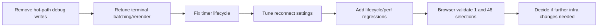

# Localhost Websocket Performance Recovery Plan

## Goal

Restore fast localhost UX and stable navigation/websocket behavior after the recent streaming changes, while keeping large-output safety protections.

## Key Findings

- The biggest likely regressions are in hot-path runtime behavior, not network topology:
  - aggressive timer-driven flush cadence and heavy rerender behavior in `[/Users/operator/Documents/git/dbt-labs/terraform-dbtcloud-yaml/importer/web/components/terminal_output.py](/Users/operator/Documents/git/dbt-labs/terraform-dbtcloud-yaml/importer/web/components/terminal_output.py)`
  - synchronous debug logging/file I/O in hot paths (terminal flush + app save-state debug paths)
- For localhost, adding Caddy is unlikely to improve performance or websocket stability; it adds complexity and another hop without addressing event-loop blocking.

## Caddy Decision

- **Do not introduce Caddy now** for local perf/stability remediation.
- Re-evaluate only if we need HTTPS parity, multi-service routing, or auth/cookie constraints in local dev.

## Recovery Workstreams

1. **Remove hot-path debug overhead**

- Gate or disable debug file writes in hot paths (terminal flush and state save diagnostics).
- Keep debug hooks behind explicit env flags only.

1. **Retune terminal streaming behavior**

- Relax flush pressure (higher interval, smaller sustained work per tick).
- Reduce/avoid full rerender bursts under trim pressure.
- Ensure queue flush is no-op when detached/idle.

1. **Fix timer lifecycle and cleanup**

- Ensure timer is not permanently active when no pending messages.
- Stop/deactivate timer on clear/disconnect/page teardown.
- Prevent orphan timer callbacks across navigation.

1. **Adjust connection resilience settings**

- Tune NiceGUI runtime options in app run config (for example reconnect window/history) after hot-path fixes.
- Keep changes minimal and measurable.

1. **Add focused regression coverage**

- Add unit coverage for timer lifecycle behavior (idle, teardown, detached).
- Add performance guard tests around batch/rerender thresholds.
- Keep existing large-output correctness tests intact.

1. **Validate with browser and perf checkpoints**

- Browser validation path:
  - single-resource selection
  - 48-resource selection
  - repeated navigation/button clicks to check reconnection behavior
- Capture before/after metrics:
  - time-to-interactive after action
  - websocket disconnect/reconnect incidence
  - CPU hotspot check if needed

## Execution Sequence

## Exit Criteria

- Navigation and button interactions remain responsive under normal use.
- 48-selection plan/apply path no longer triggers frequent websocket disconnects.
- No regressions in bounded-output behavior and test coverage for streaming safety.

