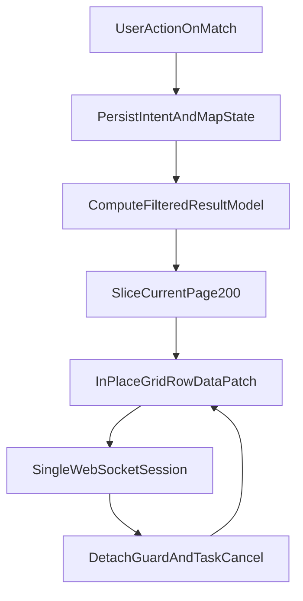

# Structural WebSocket Fix Plan (No Redis/SQLite)

## Goal

Deliver a structurally stable `match <-> fetch_target` experience on localhost by reducing websocket pressure at the source and making UI updates lifecycle-safe, while introducing a livable paginated UI (`200` rows/page default).

## Why No Redis/SQLite In Phase 1

- Current durable intent state is already file-backed per project (`target-intent.json`, `protection-intent.json`) and does not require distributed coordination.
- The active failure mode is websocket/update lifecycle churn, not durable-state contention.
- Adding Redis/SQLite now increases migration complexity without directly addressing route-transition websocket drops.

## Implementation Streams

### 1) Server-side Match pagination + query model

- Add a paginated row query path in [importer/web/components/match_grid.py](/Users/operator/Documents/git/dbt-labs/terraform-dbtcloud-yaml/importer/web/components/match_grid.py) and [importer/web/pages/match.py](/Users/operator/Documents/git/dbt-labs/terraform-dbtcloud-yaml/importer/web/pages/match.py):
  - `page`, `page_size` (default `200`), `sort`, filter model.
  - Return only visible slice to AG Grid instead of whole dataset on every refresh.
- Keep existing summary counts computed from full filtered result set, but render rows from current page only.
- Add UI controls for page size (`100/200/300`) and next/prev/jump page in toolbar.

### 2) Eliminate reload-first mutation paths

- Replace remaining mutation-triggered `ui.navigate.reload()` in [importer/web/pages/match.py](/Users/operator/Documents/git/dbt-labs/terraform-dbtcloud-yaml/importer/web/pages/match.py) with in-place grid/data refresh methods.
- Restrict hard reload to explicit recovery actions only (manual "Reload Page" fallback).
- Ensure every bulk action (accept/reject/adopt/ignore/reset/toggles) updates:
  - persisted state,
  - paginated data model,
  - current page rows,
  - summary badges/card counts.

### 3) Lifecycle safety and cancellation contract

- Centralize page runtime token + cancellation in [importer/web/pages/match.py](/Users/operator/Documents/git/dbt-labs/terraform-dbtcloud-yaml/importer/web/pages/match.py):
  - cancel pending async UI tasks when page detaches,
  - guard all async grid updates (`run_grid_method`) with detached-client checks,
  - prevent stale callback writes after navigation.
- Apply same detached-notify/callback guard pattern in [importer/web/pages/fetch_target.py](/Users/operator/Documents/git/dbt-labs/terraform-dbtcloud-yaml/importer/web/pages/fetch_target.py) for any post-fetch UI emit paths.

### 4) WebSocket pressure/health instrumentation (low overhead)

- Add lightweight counters/timing in [importer/web/pages/match.py](/Users/operator/Documents/git/dbt-labs/terraform-dbtcloud-yaml/importer/web/pages/match.py) and [importer/web/app.py](/Users/operator/Documents/git/dbt-labs/terraform-dbtcloud-yaml/importer/web/app.py):
  - page refresh mode used (in-place vs hard reload),
  - rows rendered per update,
  - detached-client suppression count.
- Keep instrumentation env-gated (same style as `IMPORTER_WS_DEBUG`) to avoid hot-path I/O by default.

### 5) Regression tests + soak validation

- Add/extend tests for pagination and lifecycle behavior:
  - [importer/web/tests/test_terminal_output_performance.py](/Users/operator/Documents/git/dbt-labs/terraform-dbtcloud-yaml/importer/web/tests/test_terminal_output_performance.py)
  - new focused Match lifecycle/pagination test module (e.g. `importer/web/tests/test_match_pagination_lifecycle.py`).
- Browser soak validation (headed): repeated `match <-> fetch_target` transitions with bulk actions on Match, verifying no timeout/reconnect loop signatures.

## Target Architecture (Phase 1)

## Acceptance Criteria

- Match defaults to `200` rows/page and supports `100/200/300` page sizes.
- No automatic full-page reloads for normal Match mutations.
- Repeated `match <-> fetch_target` navigation does not trigger websocket timeout/reconnect loops in fresh console/error logs.
- Bulk actions update page rows and summary counts correctly under pagination.
- New/updated tests pass; focused browser soak passes.

