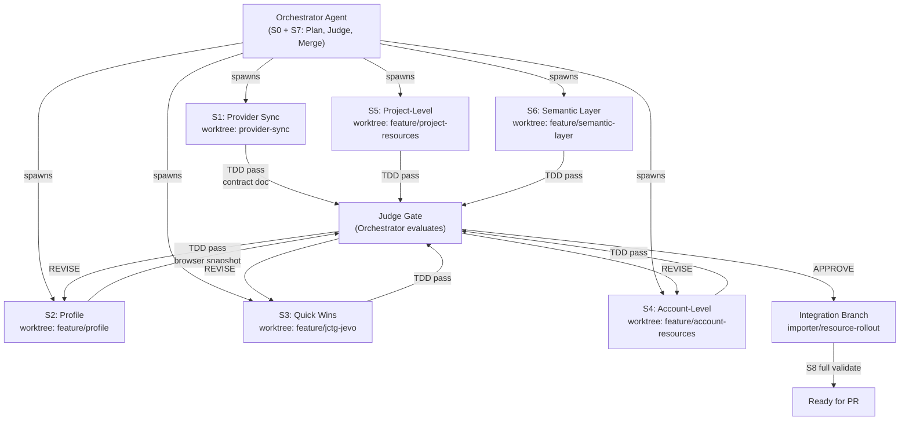

# Profile + Missing Resource Rollout Plan

## Autonomous Swarm Execution Model

---

## Outcome

Deliver provider-main alignment and end-to-end importer support for `dbtcloud_profile` and a prioritized set of currently-missing provider resource types, using a **plan → execute → judge** multi-agent swarm pattern.

---

## Swarm Architecture




**Rules:**

- Each stream operates in its own **git worktree** at a named path; it never touches `main` or `importer` directly.
- Each stream must output a **stream report** (pass/fail counts, test command, and summary) before the judge evaluates it.
- The judge merges streams in dependency-safe order: S1 then S2 then S3 then S4 then S5 then S6.
- If a stream is REVISEd it resumes in the same worktree.

**Micro commits (track progress):**

- Commit after each **logical unit** of work (e.g. one resource’s `resource_metadata` model+schema, one CRUD preservation fix, one plan step), not only at end of stream.
- Use **conventional / semantic** style: `feat(scope): short description` or `fix(scope): description`; for provider: `feat(provider): add resource_metadata to X`.
- In the commit message body (optional), reference the **plan step or resource** (e.g. `S1: resource_metadata`, `profile (PRF)`).
- Micro commits give a clear history for review, easy revert of single changes, and a visible checkpoint if the agent is interrupted.

---

## Repo Topology

```
terraform-provider-dbtcloud/
  fix/provider-bug-wsargent    <- base; 13 commits behind origin/main
  origin/main                  <- target for S1

terraform-dbtcloud-yaml/
  importer                     <- canonical trunk
  importer/resource-rollout    <- S7 integration branch (created by orchestrator)
  worktrees/
    feature/profile/           <- S2 worktree
    feature/jctg-jevo/         <- S3 worktree
    feature/account-resources/ <- S4 worktree
    feature/project-resources/ <- S5 worktree
    feature/semantic-layer/    <- S6 worktree
```

Existing worktree: `/Users/operator/Documents/git/dbt-labs/terraform-dbtcloud-yaml-squash` (squash-ready) — do not use for new streams.

---

## Stream Specifications

### S0 — Orchestrator Bootstrap

**Agent role:** Central planner and judge. Runs before all other streams and after each completes.

**Bootstrap tasks:**

- Create integration branch `importer/resource-rollout` from current `importer` HEAD.
- Create all worktrees (see topology above) from that branch.
- Write `.streams/registry.json` tracking stream status: `pending | running | review | approved | merged`.
- Write `.streams/resource-matrix.md` with the canonical per-resource classification (see matrix below).
- Define per-stream judge criteria (see Judge Rubric section).

**Judge tasks (S7):**

- After each stream signals completion, read its stream report.
- Evaluate against rubric; set status to `approved` or `revise`.
- On `approved`: merge worktree branch into integration branch using `--no-ff`.
- After all approved: trigger S8.

---

### S1 — Provider Sync

**Worktree:** `../terraform-provider-dbtcloud` (in-place, on branch `fix/provider-bug-wsargent`)
**Target:** rebase/merge onto `origin/main`
**Key conflict file:** [pkg/framework/objects/repository/resource.go](file:///Users/operator/Documents/git/dbt-labs/terraform-provider-dbtcloud/pkg/framework/objects/repository/resource.go) — contains debug instrumentation (`#region agent log`) that must be preserved or formally removed with consent.

**TDD gates (Go tests):**

```bash
cd terraform-provider-dbtcloud
make build                     # must succeed
go test ./...                  # must pass (skip acceptance tests)
```

**Stream report must include:**

- Conflict resolution summary (file, strategy, outcome)
- Which custom fixes were kept vs. cleanly merged
- Profile resource API contract for importer consumers (resource type name, ID format, `primary_profile_id` mutual-exclusion rule)

---

### S2 — Profile (Foundation Stream)

**Execution mode:** implement directly on `importer` (Option A)
**Reference only:** `worktrees/feature/profile`
**Type code:** `PRF`
**Provider resource:** `dbtcloud_profile` (import format: `project_id:profile_id`)
**Scope:** project-scoped resource — parent is `PRJ`, depth 2

**Validation guardrails for this session:**

- Use the stale `worktrees/feature/profile` branch only as a donor for snippets or schema ideas; do not revive it as the implementation branch.
- Browser validation must use the migration web app with the `PS Sandbox` project selected before any fetch/scope/match/deploy checks.
- Terraform validation for S2 is **plan-only**: generate files, run validation/plan, inspect output. Do **not** run apply or destroy.

**Implementation status (2026-03-09):**

- Core S2 profile support is now implemented directly on `importer` across models, fetcher, normalizer, schema, Terraform modules, adoption/protection maps, and resource metadata plumbing.
- Remaining PRF UI/reporting gaps identified during the crash recovery pass were closed in scope/mapping filters, fetch counts, progress tree, entity table, target matcher, deploy/destroy labels, YAML stats, and report outputs.
- Validation completed under the `PS Sandbox` rule with Terraform kept non-destructive:
  - targeted regression suite passed (`212 passed`)
  - browser verification confirmed live source fetch/profile counts (`Profiles: 125`) and scope selection summary (`Profile (PRF): 125/125`)
  - no `terraform apply` or destroy actions were executed
- Browser validation exposed one last deploy-summary omission for `Profiles`; that summary path was patched immediately and locked with a contract test. Final deploy-summary math was also confirmed against the generated PS Sandbox YAML (`profiles=125`, total resources `893`).
- If the app session reloads or the server restarts, re-select `PS Sandbox` and re-load credentials before continuing.

**Dependency model:**

- `PRF` depends on `CON` (connection_id, required)
- `PRF` depends on `CRD` (credentials_id, required)
- `PRF` depends on `EXTATTR` (extended_attributes_id, optional, linked)
- `ENV.primary_profile_id` references `PRF` (deployment environments only)
- Preserve existing environment connection/credential normalization so Terraform can still materialize credential resources, but suppress `connection_id` / `credential_id` / `extended_attributes_id` on the `dbtcloud_environment` resource whenever `primary_profile_id` is set.

**TDD — write failing tests first, then implement:**

Red phase tests to write:

- `test/test_normalizer.py` — `test_profile_normalization`
- `test/test_hierarchy_index.py` — `test_profile_parent_is_project`, `test_profile_depth_is_2`
- `importer/web/tests/test_protection_manager.py` — `test_prf_resource_type_map`, `test_prf_extended_resource_type_map`, `test_prf_type_labels`
- `importer/web/tests/test_resource_metadata_contract.py` — `test_prf_in_all_maps`
- `importer/web/tests/test_match_grid.py` — `test_prf_type_filter_visible`
- `importer/web/tests/test_adoption_imports.py` — `test_prf_import_address`
- `test/schema_validation_test.py` or equivalent schema gate — profile YAML accepted with `projects[].profiles[]` and `environments[].primary_profile_key`

**Files to modify (in PRD 41.02 checklist order):**

- [importer/models.py](file:///Users/operator/Documents/git/dbt-labs/terraform-dbtcloud-yaml/importer/models.py) — Add `Profile` model; add `profiles` to `Project`
- [importer/fetcher.py](file:///Users/operator/Documents/git/dbt-labs/terraform-dbtcloud-yaml/importer/fetcher.py) — `_fetch_profiles()`; add to project fetch loop
- [importer/element_ids.py](file:///Users/operator/Documents/git/dbt-labs/terraform-dbtcloud-yaml/importer/element_ids.py) — Register `PRF` with `parent_project_id`, `connection_id`, `extended_attributes_key`
- [schemas/v2.json](file:///Users/operator/Documents/git/dbt-labs/terraform-dbtcloud-yaml/schemas/v2.json) — Add `Profile` `$def`; add `profiles` array to project schema
- [importer/normalizer/core.py](file:///Users/operator/Documents/git/dbt-labs/terraform-dbtcloud-yaml/importer/normalizer/core.py) — Normalize profiles per-project
- [importer/yaml_converter.py](file:///Users/operator/Documents/git/dbt-labs/terraform-dbtcloud-yaml/importer/yaml_converter.py) — Confirm no additional secret-loading path is needed when profiles reuse environment credential resources
- [modules/projects_v2/](file:///Users/operator/Documents/git/dbt-labs/terraform-dbtcloud-yaml/modules/projects_v2/) — Add `profiles.tf` with protected/unprotected blocks
- [modules/projects_v2/environments.tf](file:///Users/operator/Documents/git/dbt-labs/terraform-dbtcloud-yaml/modules/projects_v2/environments.tf) — Add `primary_profile_id` resolution and suppress direct connection/credential/extended-attributes args when profile-backed
- [modules/projects_v2/outputs.tf](file:///Users/operator/Documents/git/dbt-labs/terraform-dbtcloud-yaml/modules/projects_v2/outputs.tf) — Expose `profile_ids`
- [importer/web/utils/terraform_state_reader.py](file:///Users/operator/Documents/git/dbt-labs/terraform-dbtcloud-yaml/importer/web/utils/terraform_state_reader.py) — `TF_TYPE_TO_CODE["dbtcloud_profile"] = "PRF"`
- [importer/web/utils/protection_manager.py](file:///Users/operator/Documents/git/dbt-labs/terraform-dbtcloud-yaml/importer/web/utils/protection_manager.py) — `RESOURCE_TYPE_MAP["PRF"]`, `EXTENDED_RESOURCE_TYPE_MAP["PRF"]`, `TYPE_LABELS["PRF"]`, all 5 secondary maps
- [importer/web/components/hierarchy_index.py](file:///Users/operator/Documents/git/dbt-labs/terraform-dbtcloud-yaml/importer/web/components/hierarchy_index.py) — `ENTITY_PARENT_TYPES["PRF"] = ["PRJ"]`, `TYPE_DEPTH["PRF"] = 2`, `TYPE_SORT_ORDER["PRF"] = 26`, `get_linked_entities` for PRF/EXTATTR
- [importer/web/utils/adoption_dependencies.py](file:///Users/operator/Documents/git/dbt-labs/terraform-dbtcloud-yaml/importer/web/utils/adoption_dependencies.py) — Parent chain for PRF
- [importer/web/utils/erd_graph_builder.py](file:///Users/operator/Documents/git/dbt-labs/terraform-dbtcloud-yaml/importer/web/utils/erd_graph_builder.py) — `NODE_STYLES["PRF"]`; edges to CON, CRD, EXTATTR
- [importer/web/pages/mapping.py](file:///Users/operator/Documents/git/dbt-labs/terraform-dbtcloud-yaml/importer/web/pages/mapping.py) — All 5 maps: `RESOURCE_TYPES`, `TYPE_CODE_MAP`, `resource_filter_map`, 2x `type_to_filter`
- [importer/web/pages/scope.py](file:///Users/operator/Documents/git/dbt-labs/terraform-dbtcloud-yaml/importer/web/pages/scope.py) — Same 5 maps
- [importer/web/pages/deploy.py](file:///Users/operator/Documents/git/dbt-labs/terraform-dbtcloud-yaml/importer/web/pages/deploy.py) — 3 `type_labels` dicts
- [importer/web/pages/fetch_source.py](file:///Users/operator/Documents/git/dbt-labs/terraform-dbtcloud-yaml/importer/web/pages/fetch_source.py) — `resource_counts["profiles"]`, terminal summary line
- [importer/web/pages/fetch_target.py](file:///Users/operator/Documents/git/dbt-labs/terraform-dbtcloud-yaml/importer/web/pages/fetch_target.py) — `resource_counts["profiles"]`, terminal summary line
- [importer/web/components/progress_tree.py](file:///Users/operator/Documents/git/dbt-labs/terraform-dbtcloud-yaml/importer/web/components/progress_tree.py) — project resource label for `profiles`
- [importer/web/pages/explore_source.py](file:///Users/operator/Documents/git/dbt-labs/terraform-dbtcloud-yaml/importer/web/pages/explore_source.py) — Ensure `apply_element_ids` path includes PRF
- [importer/web/pages/explore_target.py](file:///Users/operator/Documents/git/dbt-labs/terraform-dbtcloud-yaml/importer/web/pages/explore_target.py) — Same pattern
- [importer/web/pages/destroy.py](file:///Users/operator/Documents/git/dbt-labs/terraform-dbtcloud-yaml/importer/web/pages/destroy.py) and removal_management.py — `type_labels["PRF"]`, tf_type_map
- [importer/web/components/entity_table.py](file:///Users/operator/Documents/git/dbt-labs/terraform-dbtcloud-yaml/importer/web/components/entity_table.py) — PRF grid extraction and default columns
- [importer/reporter.py](file:///Users/operator/Documents/git/dbt-labs/terraform-dbtcloud-yaml/importer/reporter.py) — profile counts + detail sections
- [importer/web/components/match_grid.py](file:///Users/operator/Documents/git/dbt-labs/terraform-dbtcloud-yaml/importer/web/components/match_grid.py) — type filter label for `PRF`
- [importer/web/components/target_matcher.py](file:///Users/operator/Documents/git/dbt-labs/terraform-dbtcloud-yaml/importer/web/components/target_matcher.py) — label for `PRF`
- `test/fixtures/` and `importer/web/tests/fixtures/` — Add PRF YAML, state, protection-intent fixtures

**Test command:**

```bash
uv run pytest importer/web/tests/test_protection_manager.py \
  importer/web/tests/test_resource_metadata_contract.py \
  importer/web/tests/test_match_grid.py \
  importer/web/tests/test_adoption_imports.py \
  test/test_normalizer.py test/test_hierarchy_index.py -v
```

---

### S3 — Quick Wins: JCTG + JEVO Map Gaps

**Worktree:** `worktrees/feature/jctg-jevo`

**Gap:** Both codes exist in `TF_TYPE_TO_CODE` and `terraform_import.py` but are absent from `RESOURCE_TYPE_MAP`, `EXTENDED_RESOURCE_TYPE_MAP`, `TYPE_LABELS`, `hierarchy_index`, `mapping.py`, `scope.py`, and `deploy.py` type_labels.

**TDD — write failing tests first:**

- `importer/web/tests/test_resource_metadata_contract.py` — `test_jctg_in_all_maps`, `test_jevo_in_all_maps`
- `importer/web/tests/test_protection_manager.py` — `test_jctg_resource_type_map`, `test_jevo_resource_type_map`

**Files to touch:** same 7-file cluster as profile (protection_manager, hierarchy_index, mapping.py, scope.py, deploy.py, destroy.py, terraform_state_reader).

**Test command:**

```bash
uv run pytest importer/web/tests/test_protection_manager.py \
  importer/web/tests/test_resource_metadata_contract.py -v
```

---

### S4 — Account-Level Resources

**Worktree:** `worktrees/feature/account-resources`
**Resources:** `dbtcloud_account_features` (ACFT), `dbtcloud_ip_restrictions_rule` (IPRST), `dbtcloud_lineage_integration` (LNGI), `dbtcloud_oauth_configuration` (OAUTH)

**Type codes:** all account-level, parent `ACC`, depth 1.

**Scoping notes:**

- `account_features` is likely singleton (one per account); no `for_each`; import format TBD from provider docs.
- `ip_restrictions_rule` and `lineage_integration` need API endpoint confirmation (orchestrator provides in stream brief).
- `oauth_configuration` carries a `guarded` flag (sensitive credential-adjacent resource); mark read-only in YAML if needed.

**TDD:** same red-green-refactor pattern; write failing metadata contract tests first.

**Test command:**

```bash
uv run pytest importer/web/tests/test_resource_metadata_contract.py \
  importer/web/tests/test_protection_manager.py -v -k "acft or iprst or lngi or oauth"
```

---

### S5 — Project-Level Resources

**Worktree:** `worktrees/feature/project-resources`
**Resources:** `dbtcloud_project_artefacts` (PARFT), `dbtcloud_user_groups` (USRGRP)

**Scoping notes:**

- `project_artefacts` is project-scoped; parent `PRJ`, depth 2.
- `user_groups` is user/group assignment; confirm if account-level or project-level before implementing.

**TDD:** write failing tests first; use EXTATTR as reference implementation.

**Test command:**

```bash
uv run pytest importer/web/tests/test_resource_metadata_contract.py \
  importer/web/tests/test_protection_manager.py -v -k "parft or usrgrp"
```

---

### S6 — Semantic Layer

**Worktree:** `worktrees/feature/semantic-layer`
**Resources:** `dbtcloud_semantic_layer_configuration` (SLCFG), `dbtcloud_semantic_layer_credential_service_token_mapping` (SLSTM)

**Scoping notes:**

- Known gap in importer status docs: "documented, not implemented; API research needed."
- Orchestrator supplies API endpoint contract in stream brief before S6 starts.
- `SLCFG` is likely project-scoped; `SLSTM` may be account-level.
- S6 is lowest priority and depends on orchestrator clearing the API blocker — start last.

**TDD:** failing tests first (metadata contract + state reader) even if full implementation is partial; partial implementations are acceptable here with a clear `guarded` marker.

---

### S7 — Orchestrator Judge Rubric

Orchestrator evaluates each stream against this rubric before approving merge.

**Mandatory (all streams):**

- All new type codes appear in `TF_TYPE_TO_CODE`
- All new type codes appear in `RESOURCE_TYPE_MAP` AND `EXTENDED_RESOURCE_TYPE_MAP`
- All new type codes appear in 5 secondary protection maps (TYPE_LABELS, format_protection_warnings, generate_repair_moved_blocks, format_mismatches_for_display, detect_protection_mismatches)
- All new type codes appear in `ENTITY_PARENT_TYPES`, `TYPE_DEPTH`, `TYPE_SORT_ORDER`
- All new type codes appear in `mapping.py` and `scope.py` (5 maps each)
- All new type codes appear in `deploy.py` (3 `type_labels` dicts)
- Unit tests pass: `uv run pytest importer/web/tests/ test/test_normalizer.py test/test_hierarchy_index.py -v`
- Import smoke test passes: `python -c "from importer.fetcher import fetch_account_snapshot"`
- Stream report file written to `.streams/<stream-id>.report.md`

**Profile-specific (S2 only):**

- `primary_profile_id` on ENV never emitted alongside `connection_id`/`credential_id`/`extended_attributes_id`
- Browser snapshot confirms profile appears in match grid type filter
- `profiles.tf` module exists with protected/unprotected blocks
- Browser validation stays on `PS Sandbox` and reaches `terraform plan` only; no apply/destroy evidence is accepted for S2 completion

**Judge verdict output:**

- `APPROVE` — orchestrator merges worktree into integration branch
- `REVISE(reason)` — orchestrator writes revision brief; stream agent resumes

---

### S8 — Final Integration Validation

**Branch:** `importer/resource-rollout`

**Full test suite:**

```bash
uv run pytest \
  importer/web/tests/ \
  test/test_hierarchy_index.py \
  test/test_normalizer.py \
  test/test_web_workflow.py \
  test/schema_validation_test.py \
  -v --tb=short
```

**Browser validation (restart + smoke):**

```bash
./restart_web.sh
# navigate to /fetch_target -> Load .env -> /match -> verify new type filter chips visible
```

**Coverage gate:** existing test count must not regress; new streams add net-positive tests.

---

### S9 — Documentation, PRDs, Changelogs & Skills

**Owner:** Orchestrator (or a dedicated docs subagent). Runs on the integration branch after S8 passes.

**Scope:** Ensure all documentation and release artifacts are updated so the rollout is auditable and future agents/skills stay aligned.

#### PRDs

- **Create or update:**
  - **New PRD** (e.g. `prd/41.03-Profile-Resource-Support.md` or `prd/44.01-Missing-Resource-Rollout.md`): scope, success criteria, and pointer to 41.02 checklist for profile + each added resource type; link to resource matrix in `.streams/resource-matrix.md`.
  - **Update [prd/41.02-Adding-New-Terraform-Object-Support.md](file:///Users/operator/Documents/git/dbt-labs/terraform-dbtcloud-yaml/prd/41.02-Adding-New-Terraform-Object-Support.md):** add Profile (PRF) and any new type codes to Section 17 (Abbreviation Standards) and Section 18 (Test Coverage Assessment) if not already covered.
  - **Update [prd/00.01-Standards-of-Development.md](file:///Users/operator/Documents/git/dbt-labs/terraform-dbtcloud-yaml/prd/00.01-Standards-of-Development.md):** if any new “when adding new resource types” guidance is needed from this rollout, add it.
- **Reference:** Follow [dev_support/VERSION_UPDATE_CHECKLIST.md](file:///Users/operator/Documents/git/dbt-labs/terraform-dbtcloud-yaml/dev_support/VERSION_UPDATE_CHECKLIST.md) for release-related doc touchpoints.

#### Changelogs & version docs

- **[CHANGELOG.md](file:///Users/operator/Documents/git/dbt-labs/terraform-dbtcloud-yaml/CHANGELOG.md):** Add entries under Unreleased (or under new version heading when cutting release), e.g.:
  - Added: support for `dbtcloud_profile` (PRF); support for JCTG/JEVO in protection and UI maps; support for account/project/semantic-layer resources (per matrix).
  - Changed: provider sync contract; dependency graph and type maps.
- **[importer/VERSION](file:///Users/operator/Documents/git/dbt-labs/terraform-dbtcloud-yaml/importer/VERSION):** Bump per semver (e.g. MINOR for new resource types) when preparing release.
- **[dev_support/importer_implementation_status.md](file:///Users/operator/Documents/git/dbt-labs/terraform-dbtcloud-yaml/dev_support/importer_implementation_status.md):** Update header version and “Last Updated”; in Known Limitations / supported resources, list newly supported types (PRF, JCTG, JEVO, ACFT, etc.) and remove or qualify “not implemented” for semantic layer if S6 delivered partial support.
- **Release notes:** When tagging a release, add `dev_support/RELEASE_NOTES_vX.Y.Z.md` per VERSION_UPDATE_CHECKLIST (summary of new resources, provider alignment, and any breaking or guarded behaviors).

#### Skills

- **Update [.cursor/skills/migration-webapp-browsermcp/SKILL.md](file:///Users/operator/Documents/git/dbt-labs/terraform-dbtcloud-yaml/.cursor/skills/migration-webapp-browsermcp/SKILL.md):** In “Scope” or “Validation” (or equivalent), note that Match/Scope type filters and deploy summaries now include Profile and any other new types; add any new type-code or filter names agents should expect (e.g. PRF, JCTG, JEVO) so browser validation and debugging stay accurate.
- **Optional — new skill:** If the team wants a dedicated “resource-type rollout” or “41.02 checklist” skill for future rollouts, create `.cursor/skills/<name>/SKILL.md` that references this plan, the resource matrix, and PRD 41.02; list touchpoint files and TDD gates. S9 can include “create skill X” as an optional task.

**Judge gate for S9:** Before marking “Ready for PR”, orchestrator verifies: (1) at least one PRD created or updated for profile/rollout, (2) CHANGELOG and implementation status updated, (3) migration-webapp-browsermcp skill updated with new types.

---

## Resource Classification Matrix


| Resource                                                   | Code     | Scope   | Parent  | Depth | Stream | Status                   |
| ---------------------------------------------------------- | -------- | ------- | ------- | ----- | ------ | ------------------------ |
| `dbtcloud_profile`                                         | `PRF`    | project | PRJ     | 2     | S2     | implement-now            |
| `dbtcloud_job_completion_trigger`                          | `JCTG`   | env/prj | ENV,PRJ | 3     | S3     | implement-now (maps gap) |
| `dbtcloud_environment_variable_job_override`               | `JEVO`   | job     | JOB     | 4     | S3     | implement-now (maps gap) |
| `dbtcloud_account_features`                                | `ACFT`   | account | ACC     | 1     | S4     | implement-now            |
| `dbtcloud_ip_restrictions_rule`                            | `IPRST`  | account | ACC     | 1     | S4     | implement-now            |
| `dbtcloud_lineage_integration`                             | `LNGI`   | account | ACC     | 1     | S4     | implement-now            |
| `dbtcloud_oauth_configuration`                             | `OAUTH`  | account | ACC     | 1     | S4     | guarded (sensitive)      |
| `dbtcloud_project_artefacts`                               | `PARFT`  | project | PRJ     | 2     | S5     | implement-now            |
| `dbtcloud_user_groups`                                     | `USRGRP` | account | ACC     | 1     | S5     | guarded (confirm scope)  |
| `dbtcloud_semantic_layer_configuration`                    | `SLCFG`  | project | PRJ     | 2     | S6     | guarded (API research)   |
| `dbtcloud_semantic_layer_credential_service_token_mapping` | `SLSTM`  | account | ACC     | 1     | S6     | guarded (API research)   |


**Already supported (no action):**

- PRJ, ENV, JOB, CON, REP, PREP, EXTATTR, VAR, TOK, GRP, CRD — full support
- NOT, WEB, PLE — partial (deferred; documented blockers)

---

## TDD Protocol (All Streams)

Every stream follows Red then Green then Refactor:

1. **Red:** Write the failing test asserting the new type code exists in the target map/behavior. Run and confirm failure.
2. **Green:** Write the minimal implementation to make the test pass.
3. **Refactor:** Clean up and ensure no secondary map is missed (use PRD 41.02 Section 3 checklist).
4. **Snapshot (UI streams only):** After restart, capture browser snapshot confirming type chip visible in match grid.

Test file naming convention:

- New type-specific tests: add to existing test files where applicable (e.g. `test_protection_manager.py`)
- Metadata contract (all maps covered): `test_resource_metadata_contract.py`
- Hierarchy behavior: `test/test_hierarchy_index.py`

---

## Merge Order

```
S1 (provider sync — independent repo, parallel)
  |
  v
S2 (profile — foundation; ENV primary_profile_id relies on S1 contract)
  |
  v  merge to integration branch
S3 (quick wins — can run parallel with S2; merge after S2)
  |
  v  merge
S4 (account resources — no deps on S2 outputs)
  |
  v  merge
S5 (project resources — no deps on S4)
  |
  v  merge
S6 (semantic layer — depends on API blocker cleared by orchestrator)
  |
  v  merge
S8 (final validation on integration branch)
  |
  v
S9 (documentation: PRDs, CHANGELOG, implementation status, skills)
  |
  v  Ready for PR
```

---

## File Conflict Risk Map

High-contention files touched by multiple streams — orchestrator must serialize writes or use explicit section guards:

- [protection_manager.py](file:///Users/operator/Documents/git/dbt-labs/terraform-dbtcloud-yaml/importer/web/utils/protection_manager.py) — touched by S2, S3, S4, S5, S6 — **High risk**
- [hierarchy_index.py](file:///Users/operator/Documents/git/dbt-labs/terraform-dbtcloud-yaml/importer/web/components/hierarchy_index.py) — touched by S2, S3, S4, S5, S6 — **High risk**
- [mapping.py](file:///Users/operator/Documents/git/dbt-labs/terraform-dbtcloud-yaml/importer/web/pages/mapping.py) — touched by S2, S3, S4, S5, S6 — **High risk**
- [scope.py](file:///Users/operator/Documents/git/dbt-labs/terraform-dbtcloud-yaml/importer/web/pages/scope.py) — touched by S2, S3, S4, S5, S6 — **High risk**
- [deploy.py](file:///Users/operator/Documents/git/dbt-labs/terraform-dbtcloud-yaml/importer/web/pages/deploy.py) — touched by S2, S3, S4, S5, S6 — **Med risk**
- [terraform_state_reader.py](file:///Users/operator/Documents/git/dbt-labs/terraform-dbtcloud-yaml/importer/web/utils/terraform_state_reader.py) — touched by S2, S3, S4, S5, S6 — **Med risk**
- [element_ids.py](file:///Users/operator/Documents/git/dbt-labs/terraform-dbtcloud-yaml/importer/element_ids.py) — S2 only for profiles — **Low risk**
- [models.py](file:///Users/operator/Documents/git/dbt-labs/terraform-dbtcloud-yaml/importer/models.py) — touched by S2, S4, S5, S6 — **Med risk**

**Conflict mitigation:** Each stream appends to dict literals using contiguous blocks with a stream-tagged comment, e.g. `# --- S2: profile ---`. Orchestrator cherry-picks or merges in linear order, resolving dict append conflicts trivially.

---

## Known Guardrails (from .ralph/guardrails.md)

All streams must observe:

- **One Reconcile Truth:** never mix in-memory reconcile and direct tfstate parsing without reconciliation.
- **Refresh After Sync:** immediately refresh reconcile state after plan/apply.
- **Clear Empty Derived Artifacts:** explicitly clear generated move/import artifacts if deltas are empty.
- **Fetch Error Masking:** always run `python -c "from importer.fetcher import fetch_account_snapshot"` after any fetcher.py edit.
- **Indentation Discipline:** review `fetcher.py` indentation after any edit, especially around `ThreadPoolExecutor` blocks.

