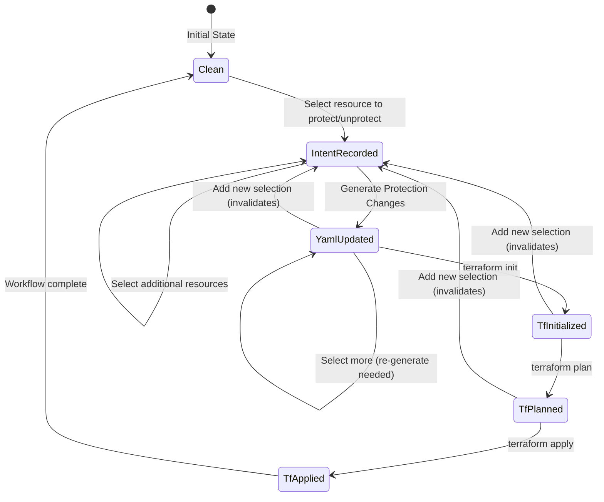

# 1. Protection Workflow Testing PRD

This document establishes the testing strategy, architecture, and foundational patterns for validating the protection workflow and serves as a template for testing other state machine workflows in the system.

**Status:** Draft  
**Created:** 2026-02-04  
**Last Updated:** 2026-02-04

---

## 1.1 Executive Summary

### Problem Statement

The terraform-dbtcloud-yaml application is fundamentally a **state management machine** that orchestrates:
- User intent capture (protection decisions)
- Configuration generation (YAML files)
- Terraform file generation (moved blocks, import blocks)
- Terraform execution (init, plan, apply, destroy)

The protection workflow spans multiple UI pages (Match, Protection Management, Destroy) and involves complex state transitions with strict sequencing requirements. Current testing gaps include:

1. No end-to-end browser tests for UI workflows
2. No validation of state transitions and invariants
3. No systematic testing of operation sequences
4. Inconsistent behavior across pages ("protection intent drift")

### Solution Overview

Implement a comprehensive testing framework that:

1. **Validates UI workflows** via Playwright browser automation
2. **Models the system as state machines** with formal state definitions and invariants
3. **Tests operation sequences** both explicitly and through generated test cases
4. **Uses appropriate Terraform mocking** (real init/plan, mocked apply/destroy)

### Success Criteria

- [ ] All critical protection workflow paths have E2E test coverage
- [ ] State machine model validates all transitions
- [ ] No invariant violations in randomized sequence testing
- [ ] Protection workflow behaves identically across all three pages

---

## 1.2 Foundational Architecture: The Application as State Machine

### Core Concept

Every workflow in this application can be modeled as a **finite state machine** with:

| Component | Description |
|-----------|-------------|
| **States** | Distinct configurations of the system (e.g., `Clean`, `IntentRecorded`, `YamlUpdated`) |
| **Actions** | User operations that trigger transitions (e.g., `select_protect`, `generate_changes`) |
| **Transitions** | Valid state changes triggered by actions |
| **Invariants** | Properties that must always hold true |
| **Side Effects** | File system, database, or external system changes |

### Benefits of State Machine Modeling

1. **Completeness** - Ensures all valid paths are tested
2. **Edge Case Discovery** - Random sequence generation finds unexpected scenarios
3. **Regression Prevention** - Invariant checking catches state corruption
4. **Documentation** - State diagrams serve as living documentation
5. **Debugging** - State traces help reproduce failures

### State Machine Template

```python
from dataclasses import dataclass, field
from enum import Enum, auto
from typing import List, Set, Optional

class WorkflowState(Enum):
    """Define all possible states."""
    INITIAL = auto()
    # ... add states
    TERMINAL = auto()

class Action(Enum):
    """Define all possible actions."""
    START = auto()
    # ... add actions
    COMPLETE = auto()

@dataclass
class WorkflowModel:
    """State machine model for a workflow."""
    
    state: WorkflowState = WorkflowState.INITIAL
    # ... add state variables
    
    def valid_actions(self) -> List[Action]:
        """Get actions valid from current state."""
        # Return list based on current state
        pass
    
    def apply_action(self, action: Action, **kwargs) -> 'WorkflowModel':
        """Apply action and return new state."""
        # Create new model with updated state
        pass
    
    def check_invariants(self) -> List[str]:
        """Check all invariants, return violations."""
        violations = []
        # Check each invariant
        return violations
```

---

## 1.3 Terraform Execution Strategy

### Architectural Decision: Real Init/Plan, Mocked Apply/Destroy

The application generates Terraform configurations and executes Terraform commands. Testing requires balancing:

- **Realism** - Tests should validate actual Terraform behavior
- **Safety** - Tests must not modify real cloud resources
- **Speed** - Tests should execute quickly
- **Isolation** - Tests should not interfere with each other

### Decision Matrix

| Operation | Strategy | Rationale |
|-----------|----------|-----------|
| `terraform init` | **Real** | Validates provider configuration, module structure, backend setup. Fast and safe. |
| `terraform validate` | **Real** | Validates HCL syntax and configuration. Fast and safe. |
| `terraform plan` | **Real** | Validates moved blocks, import blocks, resource changes. Critical for correctness. Safe (read-only). |
| `terraform apply` | **Mocked** | Would modify real cloud resources. Simulate state updates locally. |
| `terraform destroy` | **Mocked** | Would delete real cloud resources. Simulate state updates locally. |

### Mock Implementation Patterns

#### Mocked Apply

```python
class TerraformRunner:
    """Terraform execution with selective mocking."""
    
    def apply_mocked(self) -> TerraformResult:
        """Simulate apply without cloud changes.
        
        Actions:
        1. Parse the plan to understand intended changes
        2. Update local state files to reflect "applied" state
        3. Clean up temporary files (e.g., protection_moves.tf)
        4. Update intent file to mark applied_to_tf_state=True
        """
        # Read plan file to understand changes
        plan = self._read_plan_file()
        
        # Update intent tracking
        self._mark_intents_applied_to_tf_state(plan.moved_resources)
        
        # Clean up generated files
        self._remove_moves_file_if_exists()
        
        return TerraformResult(
            success=True,
            stdout="Apply complete! (mocked - no cloud changes)",
            stderr="",
            return_code=0
        )
```

#### Mocked Destroy

```python
def destroy_mocked(self, resources: List[str]) -> TerraformResult:
    """Simulate destroy without cloud changes.
    
    Actions:
    1. Remove resources from local state tracking
    2. Update YAML configuration to remove destroyed resources
    3. Log destroyed resources for verification
    """
    for resource in resources:
        self._remove_from_local_state(resource)
        self._remove_from_yaml_config(resource)
    
    return TerraformResult(
        success=True,
        stdout=f"Destroyed {len(resources)} resources (mocked)",
        stderr="",
        return_code=0
    )
```

### Test Environment Setup

```python
@pytest.fixture
def terraform_test_environment(tmp_path: Path) -> TerraformTestEnv:
    """Create isolated Terraform test environment.
    
    Structure:
    tmp_path/
    ├── terraform/
    │   ├── main.tf           # Test module configuration
    │   ├── providers.tf      # Provider with mock backend
    │   ├── variables.tf      # Test variables
    │   └── terraform.tfstate # Local state (no remote)
    ├── config/
    │   ├── dbt-cloud-config.yml
    │   └── protection-intent.json
    └── output/
        └── protection_moves.tf
    """
    env = TerraformTestEnv(tmp_path)
    env.setup_providers(backend="local")  # No remote state
    env.setup_test_module()
    return env
```

### When to Use Real vs Mocked

| Scenario | Use Real | Use Mocked |
|----------|----------|------------|
| Testing HCL generation correctness | `plan` | - |
| Testing moved block syntax | `init`, `plan` | - |
| Testing resource creation | - | `apply` |
| Testing resource deletion | - | `destroy` |
| Testing state transitions | `init`, `plan` | `apply` |
| CI/CD pipeline | `init`, `plan` | `apply`, `destroy` |
| Local development | All (with test account) | - |

---

## 1.4 UI Testing Architecture

### Playwright Page Object Model

Each page in the application gets a corresponding Page Object that encapsulates:

1. **Locators** - How to find elements on the page
2. **Actions** - What operations users can perform
3. **Assertions** - How to verify expected state

```python
class BasePage:
    """Base class for all page objects."""
    
    def __init__(self, page: Page, base_url: str):
        self.page = page
        self.base_url = base_url
    
    def navigate(self, path: str = "") -> None:
        """Navigate to a path."""
        self.page.goto(f"{self.base_url}{path}")
    
    def wait_for_page_load(self) -> None:
        """Wait for NiceGUI page to fully render."""
        self.page.wait_for_load_state("networkidle")
        self.page.wait_for_selector(".nicegui-content", state="visible")
```

### Test Data Strategy

| Data Type | Source | Isolation |
|-----------|--------|-----------|
| **YAML Config** | Fixture files | Copy per test |
| **Protection Intent** | Fixture files | Copy per test |
| **Terraform State** | Generated or fixture | Copy per test |
| **API Responses** | Mock JSON files | Shared, read-only |

### API Mocking for Isolation

```python
@pytest.fixture
def page_with_mocked_api(page: Page, mock_responses: dict) -> Page:
    """Intercept external API calls for isolation."""
    
    def handle_route(route):
        url = route.request.url
        
        # Mock dbt Cloud API
        if "cloud.getdbt.com" in url or "api.getdbt.com" in url:
            endpoint = extract_endpoint(url)
            if endpoint in mock_responses:
                route.fulfill(json=mock_responses[endpoint])
                return
        
        # Let other requests through
        route.continue_()
    
    page.route("**/*", handle_route)
    return page
```

---

## 1.5 Protection Workflow State Machine

### States



### State Definitions

| State | Intent File | YAML | TF State | Files |
|-------|-------------|------|----------|-------|
| `Clean` | Empty or all applied | Matches TF | Matches YAML | No protection_moves.tf |
| `IntentRecorded` | Has `applied_to_yaml=false` | Unchanged | Unchanged | No protection_moves.tf |
| `YamlUpdated` | Has `applied_to_yaml=true, applied_to_tf_state=false` | Updated | Unchanged | protection_moves.tf exists |
| `TfInitialized` | Same as YamlUpdated | Same | Unchanged | .terraform/ exists |
| `TfPlanned` | Same | Same | Unchanged | tfplan exists |
| `TfApplied` | All `applied_to_tf_state=true` | Matches TF | Updated | protection_moves.tf removed |

### Invariants

These properties must **always** hold true:

1. **No duplicate intents**: A resource key appears at most once in the intent file
2. **Intent precedence**: Intent file always takes precedence over YAML for effective protection
3. **Subset relationships**: `tf_applied ⊆ yaml_applied ⊆ all_intents`
4. **Moves file consistency**: `protection_moves.tf` exists iff there are pending TF updates
5. **REPO consolidation**: A single `REPO:` intent generates exactly 2 moved blocks
6. **History completeness**: Every intent change is recorded in history
7. **Key format consistency**: All keys use `PRJ:` or `REPO:` prefix

### Actions and Transitions

| Action | Valid From | Transitions To | Side Effects |
|--------|------------|----------------|--------------|
| `select_protect(key)` | Any | IntentRecorded | Adds intent with `protected=true` |
| `select_unprotect(key)` | Any | IntentRecorded | Adds intent with `protected=false` |
| `generate_changes()` | IntentRecorded | YamlUpdated | Updates YAML, creates protection_moves.tf |
| `terraform_init()` | YamlUpdated | TfInitialized | Runs `terraform init` |
| `terraform_plan()` | TfInitialized | TfPlanned | Runs `terraform plan`, creates tfplan |
| `terraform_apply()` | TfPlanned | TfApplied | Updates TF state, removes moves file |
| `add_after_generate()` | YamlUpdated+ | IntentRecorded | Invalidates current generate |

---

## 1.6 Test Categories

### 1. Unit Tests (pytest)

Test individual components in isolation.

#### Existing Coverage

| Component | Test File | Status |
|-----------|-----------|--------|
| `ProtectionIntentManager` | `test_protection_intent.py` | Good |
| `WorkflowStep` enum | `test_web_workflow.py` | Good |
| State accessibility | `test_web_workflow.py` | Good |

#### Missing Coverage - protection_manager.py (CRITICAL)

The `protection_manager.py` module has 20+ functions with **zero test coverage**:

| Function | Priority | Test Focus |
|----------|----------|------------|
| `generate_moved_blocks()` | **Critical** | REPO consolidation: 1 `REPO:` intent → 2 moved blocks |
| `generate_moved_blocks_from_state()` | **Critical** | State-based generation with correct addresses |
| `get_resources_to_protect()` | **Critical** | Cascade discovery: PRJ → associated REPOs |
| `get_resources_to_unprotect()` | **Critical** | Cascade unprotect discovery |
| `detect_protection_mismatches()` | **High** | YAML vs TF state comparison |
| `extract_protected_resources()` | **High** | YAML parsing for `protected: true` |
| `detect_protection_changes()` | **High** | Delta detection between states |
| `write_moved_blocks_file()` | **Medium** | Valid HCL generation |
| `check_plan_for_protected_destroys()` | **Medium** | Plan JSON parsing |
| `get_resource_address()` | **Medium** | Address string formatting |
| `generate_repair_moved_blocks()` | **Medium** | Repair block generation |

#### Missing Coverage - Key Format Handling

| Test Area | What to Verify |
|-----------|----------------|
| Key prefixing | `PRJ:` for projects, `REPO:` for repositories |
| Legacy migration | Bare keys (`my_project`) → prefixed (`PRJ:my_project`) |
| Key parsing | Extract resource type and name from key |
| Consistent handling | Same key format across all components |

#### Missing Coverage - State Machine Model

| Test Area | What to Verify |
|-----------|----------------|
| State transitions | Valid action from each state |
| Invalid transitions | Rejected with clear error |
| Invariant checking | All invariants hold after transition |
| State serialization | Round-trip preserves all data |

### Test Files to Create

```
importer/web/tests/
├── test_protection_intent.py      # EXISTS - good coverage
├── test_protection_manager.py     # NEW - critical functions
├── test_key_format.py             # NEW - PRJ:/REPO: handling
├── test_workflow_model.py         # NEW - state machine
└── test_cascade_logic.py          # NEW - cascade discovery
```

### 2. Integration Tests (pytest)

Test component interactions without UI.

| Test Focus | Components |
|------------|------------|
| Intent → YAML | ProtectionIntentManager + YAML generator |
| Intent → Moves | ProtectionIntentManager + ProtectionManager |
| Full generate | Intent + YAML + Moves + File system |

### 3. E2E Browser Tests (Playwright)

Test complete workflows through the UI.

| Page | Test Focus |
|------|------------|
| Protection Management | Load without error, key format, badges, generate dialog |
| Match | Protection panel, cascading, generate workflow |
| Destroy | Protection panel, generate button, unprotect flow |
| Cross-page | Navigation, state consistency across pages |

### 4. Sequence Tests (Playwright + State Machine)

Test operation sequences with state validation.

| Type | Approach |
|------|----------|
| **Explicit scenarios** | Hand-written critical path tests |
| **Generated sequences** | Random valid sequences from state machine |
| **Edge cases** | Known problematic patterns |

### 5. Terraform Integration Tests

Test Terraform execution with real/mocked operations.

| Operation | Test Focus |
|-----------|------------|
| Init | Provider configuration, module structure |
| Plan | Moved blocks produce correct plan output |
| Apply (mocked) | State updates correctly simulated |
| Destroy (mocked) | Resource removal correctly simulated |

---

## 1.7 Test Infrastructure

### Directory Structure

```
test/
├── conftest.py                    # Shared fixtures (pytest)
├── requirements-e2e.txt           # Playwright + test dependencies
├── playwright.config.py           # Playwright configuration
│
├── unit/                          # Unit tests
│   ├── test_protection_intent.py
│   ├── test_protection_manager.py
│   └── test_workflow_model.py
│
├── integration/                   # Integration tests (no UI)
│   ├── test_generate_workflow.py
│   └── test_terraform_generation.py
│
├── e2e/                           # Playwright browser tests
│   ├── conftest.py                # E2E fixtures (server, mocking)
│   ├── fixtures/                  # Test data files
│   │   ├── app_state.json
│   │   ├── protection-intent.json
│   │   ├── dbt-cloud-config.yml
│   │   └── mock_api_responses/
│   │       ├── projects.json
│   │       └── repositories.json
│   ├── pages/                     # Page Object Models
│   │   ├── base_page.py
│   │   ├── match_page.py
│   │   ├── protection_page.py
│   │   └── destroy_page.py
│   ├── helpers/                   # Test utilities
│   │   ├── state_machine.py       # State machine model
│   │   ├── state_verifier.py      # File system assertions
│   │   └── terraform_runner.py    # TF execution with mocking
│   │
│   ├── test_protection_management.py
│   ├── test_match_protection.py
│   ├── test_destroy_protection.py
│   ├── test_protection_sequences.py
│   └── test_state_machine_generated.py
│
└── terraform/                     # Terraform integration tests
    ├── conftest.py
    ├── test_init_plan.py
    └── fixtures/
        ├── valid_config/
        └── invalid_config/
```

### Running Tests

```bash
# Unit tests (fast)
pytest test/unit/ -v

# Integration tests
pytest test/integration/ -v

# E2E tests (browser)
pytest test/e2e/ -v

# E2E with visible browser (debugging)
pytest test/e2e/ -v --headed --slowmo=500

# Sequence tests only
pytest test/e2e/test_protection_sequences.py test/e2e/test_state_machine_generated.py -v

# Terraform tests
pytest test/terraform/ -v

# All tests
pytest test/ -v

# With coverage
pytest test/ -v --cov=importer --cov-report=html
```

---

## 1.8 Extending to Other Workflows

### Workflow Inventory

The application contains multiple state machine workflows:

| Workflow | Pages | Key States |
|----------|-------|------------|
| **Protection** | Match, Protection Mgmt, Destroy | Intent → YAML → TF |
| **Import/Adopt** | Fetch, Match, Configure, Deploy | Fetch → Map → Configure → Deploy |
| **Jobs as Code** | JAC Select, Fetch, Jobs, Config, Generate | Select → Fetch → Configure → Generate |
| **Destroy** | Destroy | Select → Plan → Destroy |

### Template for New Workflow Tests

1. **Define states**: What are the distinct configurations?
2. **Define actions**: What user operations exist?
3. **Define transitions**: Which action+state combinations are valid?
4. **Define invariants**: What must always be true?
5. **Identify side effects**: What files/systems change?
6. **Create page objects**: Encapsulate UI interactions
7. **Write explicit tests**: Cover critical paths
8. **Implement state machine**: Enable generated tests

### Example: Import/Adopt Workflow

```python
class ImportAdoptState(Enum):
    """States in import/adopt workflow."""
    INITIAL = auto()
    SOURCE_FETCHED = auto()
    TARGET_FETCHED = auto()
    MAPPINGS_CONFIRMED = auto()
    CONFIGURED = auto()
    DEPLOYED = auto()

class ImportAdoptModel:
    """State machine for import/adopt workflow."""
    
    INVARIANTS = [
        "target_mappings ⊆ source_resources",
        "deployed_resources ⊆ configured_resources",
        "no_duplicate_target_ids",
    ]
    
    def valid_actions(self) -> List[Action]:
        if self.state == ImportAdoptState.INITIAL:
            return [Action.FETCH_SOURCE]
        elif self.state == ImportAdoptState.SOURCE_FETCHED:
            return [Action.FETCH_TARGET, Action.EXPLORE_SOURCE]
        # ... etc
```

---

## 1.9 Implementation Todos

### Phase 1: Infrastructure Setup

- [ ] Create `test/e2e/` directory structure
- [ ] Add Playwright dependencies to `requirements-e2e.txt`
- [ ] Create `conftest.py` with server management fixtures
- [ ] Create base page object (`base_page.py`)
- [ ] Create `TerraformRunner` helper with mock support
- [ ] Create `StateVerifier` helper

### Phase 2: Protection Workflow Tests

- [ ] Create `ProtectionManagementPage` page object
- [ ] Create `MatchPage` page object
- [ ] Create `DestroyPage` page object
- [ ] Write page load tests (fix 500 error first)
- [ ] Write key format tests
- [ ] Write generate workflow tests
- [ ] Write cascading protection tests

### Phase 3: State Machine Testing

- [ ] Implement `WorkflowModel` for protection workflow
- [ ] Implement invariant checking
- [ ] Write explicit sequence tests for critical paths
- [ ] Implement random sequence generator
- [ ] Write state machine generated tests

### Phase 4: Terraform Integration

- [ ] Create test Terraform configurations
- [ ] Write init/plan tests for moved blocks
- [ ] Implement mocked apply
- [ ] Implement mocked destroy
- [ ] Write error recovery tests

---

## 1.10 Appendix: Key Decisions Log

| Decision | Choice | Rationale | Date |
|----------|--------|-----------|------|
| E2E Framework | Playwright | Modern, reliable, good Python support | 2026-02-04 |
| State Machine Testing | Explicit + Generated | Balance coverage and maintainability | 2026-02-04 |
| Terraform Mocking | Real init/plan, mock apply/destroy | Balance realism and safety | 2026-02-04 |
| Test Data | Fixture files with copy-per-test | Isolation without regeneration overhead | 2026-02-04 |
| API Mocking | Playwright route interception | No external dependencies in tests | 2026-02-04 |

---

## Navigation

- **Previous:** [Standards of Development](00-Standards-of-Development.md)
- **Next:** [Protection Workflow Implementation](02-Protection-Workflow-Implementation.md) *(to be created)*
- **Related:** [RALPH_TASK.md](../RALPH_TASK.md)
