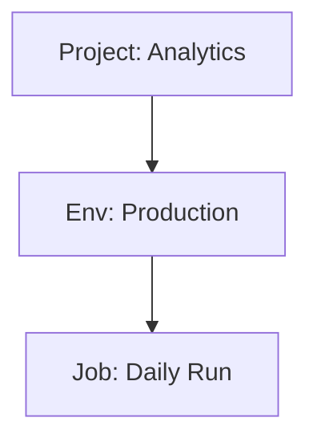

# PRD: Enhanced Resource Matching & Migration Controls

## 1. Overview

This PRD defines enhancements to the migration workflow focusing on:

- UI naming improvements for clarity
- Editable grid-based resource matching interface
- Resource duplication/cloning capability
- Job scheduling control during migration
- Report download as Markdown
- Interactive ERD visualization
- **Import & Adopt workflow** - Take existing infrastructure under Terraform control
- Environment variable dependency investigation

---

## 2. UI Renames

### 2.1 Scope Step Rename

**Current:** "Scope" | **New:** "Select Source"

**Files to modify:**

- [`importer/web/state.py`](importer/web/state.py) - Update `STEP_NAMES[WorkflowStep.SCOPE]`
- [`importer/web/pages/scope.py`](importer/web/pages/scope.py) - Update page header to "Select Entities for Migration"

### 2.2 Match Step Rename  

**Current:** "Match" | **New:** "Match Existing"

**Files to modify:**

- [`importer/web/state.py`](importer/web/state.py) - Update `STEP_NAMES[WorkflowStep.MATCH]`
- [`importer/web/pages/match.py`](importer/web/pages/match.py) - Update page header to "Match Source to Target Resources"

### 2.3 Match Page Account Tiles

The source/target account tiles at the top of the Match screen are missing account ID and URL details that other pages display.

**Update Match page tiles to include:**

- Account Name
- Account ID  
- Host URL

**Reference implementation:** See account cards in [`importer/web/pages/configure.py`](importer/web/pages/configure.py) or [`importer/web/components/account_selector.py`](importer/web/components/account_selector.py)

---

## 3. Editable Mapping Grid

### 3.1 User Stories - Grid Display

| ID | Story | Acceptance Criteria |
|----|-------|---------------------|
| US-MG-01 | As a user, I want to see all source resources in an AG Grid table | Grid renders with all resources from normalized YAML |
| US-MG-02 | As a user, I want the grid to load with auto-suggestions pre-populated | Rows with exact name matches show suggested target |
| US-MG-03 | As a user, I want to see resources grouped by type | Grouping by Type column with expand/collapse |
| US-MG-04 | As a user, I want to sort by any column | Click column header to sort asc/desc |
| US-MG-05 | As a user, I want to filter the grid by typing | Quick filter input above grid |
| US-MG-06 | As a user, I want to see row count and selected count | "45 resources, 12 selected" in footer |
| US-MG-07 | As a user, I want alternating row colors for readability | Zebra striping on rows |
| US-MG-08 | As a user, I want the grid to respect dark/light theme | Colors adapt to theme |

### 3.2 User Stories - Row Selection & Details

| ID | Story | Acceptance Criteria |
|----|-------|---------------------|
| US-MG-10 | As a user, I want to click a row to select it | Row highlights on click |
| US-MG-11 | As a user, I want to multi-select rows with Ctrl/Shift+click | Standard multi-select behavior |
| US-MG-12 | As a user, I want a "Select All" checkbox in header | Toggles all visible rows |
| US-MG-13 | As a user, I want to click a details icon to open the detail panel | Same panel as Entities table with full JSON |
| US-MG-14 | As a user, I want the detail panel to show source AND target data side-by-side | Split view when target is matched |
| US-MG-15 | As a user, I want to see differences highlighted in detail panel | Changed fields highlighted in yellow |
| US-MG-16 | As a user, I want to copy resource JSON from detail panel | Copy button for source/target JSON |

### 3.3 User Stories - Action Column

| ID | Story | Acceptance Criteria |
|----|-------|---------------------|
| US-MG-20 | As a user, I want an Action dropdown with "Match", "Create New", "Skip" | Dropdown renders in cell |
| US-MG-21 | As a user, I want "Match" to be default when suggestion exists | Pre-selected if auto-match found |
| US-MG-22 | As a user, I want "Create New" to be default when no suggestion | Pre-selected if no match |
| US-MG-23 | As a user, I want to bulk-set action for selected rows | "Set Action" button applies to selection |
| US-MG-24 | As a user, I want action changes to auto-save | No explicit save button needed |
| US-MG-25 | As a user, I want "Skip" to gray out the row | Visual indication row is excluded |
| US-MG-26 | As a user, I want to see action icon in addition to text | Match=link, Create=add, Skip=block |

### 3.4 User Stories - Target ID Input & Validation

| ID | Story | Acceptance Criteria |
|----|-------|---------------------|
| US-MG-30 | As a user, I want to enter a target ID manually | Editable text cell |
| US-MG-31 | As a user, I want the target name to auto-populate when I enter a valid ID | API lookup confirms resource exists |
| US-MG-32 | As a user, I want an error indicator if target ID doesn't exist | Red border, error icon |
| US-MG-33 | As a user, I want an error if target type doesn't match source type | Can't match job to environment |
| US-MG-34 | As a user, I want autocomplete suggestions as I type target ID | Dropdown shows matching target resources |
| US-MG-35 | As a user, I want to clear a target ID to unmatch | Clear button or backspace to empty |
| US-MG-36 | As a user, I want warning if same target matched to multiple sources | Yellow highlight, warning icon |
| US-MG-37 | As a user, I want to see target ID validation status | Green check, red X, or spinner |

### 3.5 User Stories - Status Column

| ID | Story | Acceptance Criteria |
|----|-------|---------------------|
| US-MG-40 | As a user, I want to see status: Pending, Confirmed, Rejected, Error | Status badge with color |
| US-MG-41 | As a user, I want "Pending" for unreviewed suggestions | Yellow/amber badge |
| US-MG-42 | As a user, I want "Confirmed" for accepted matches | Green badge |
| US-MG-43 | As a user, I want "Error" for invalid target IDs | Red badge |
| US-MG-44 | As a user, I want inline Accept/Reject buttons for pending rows | Checkmark and X buttons |
| US-MG-45 | As a user, I want Accept to change status to Confirmed | Updates status, saves state |
| US-MG-46 | As a user, I want Reject to clear target and set Create New | Clears match, changes action |

### 3.6 User Stories - Bulk Operations

| ID | Story | Acceptance Criteria |
|----|-------|---------------------|
| US-MG-50 | As a user, I want "Accept All Suggestions" button | Confirms all pending matches |
| US-MG-51 | As a user, I want "Reject All Suggestions" button | Clears all matches, sets Create New |
| US-MG-52 | As a user, I want "Reset All Mappings" button | Clears everything, regenerates suggestions |
| US-MG-53 | As a user, I want confirmation dialog for bulk operations | "Are you sure? This affects X resources" |
| US-MG-54 | As a user, I want to export mappings to CSV | Download current grid state |
| US-MG-55 | As a user, I want to import mappings from CSV | Upload and apply bulk mappings |

### 3.7 User Stories - Dependencies & Relationships

| ID | Story | Acceptance Criteria |
|----|-------|---------------------|
| US-MG-60 | As a user, I want to see dependent resources indented under parent | Jobs under Project, Envs under Project |
| US-MG-61 | As a user, I want parent match to suggest child matches | Match project → suggest matching envs/jobs |
| US-MG-62 | As a user, I want warning when matching child without parent | "Job's project is not matched" |
| US-MG-63 | As a user, I want to expand/collapse dependency groups | Arrow to toggle children visibility |
| US-MG-64 | As a user, I want "Match with Dependencies" option | Matches resource and all children |
| US-MG-65 | As a user, I want to see relationship lines in grouped view | Visual tree structure |

### 3.8 Grid Columns (Detailed)

| Column | Width | Description | Editable | Cell Renderer |
|--------|-------|-------------|----------|---------------|
| | 40px | Row selection checkbox | Yes | agCheckboxCellRenderer |
| Type | 120px | Resource type with icon | No | Custom icon + text |
| Source Name | 200px | Name from source account | No | Text with tooltip |
| Source ID | 100px | ID from source account | No | Monospace text |
| Action | 130px | Match/Create New/Skip | Yes | Dropdown select |
| Target ID | 120px | Manual input for target | Yes | Editable with autocomplete |
| Target Name | 200px | Auto-populated confirmation | No | Text (green if valid) |
| Status | 100px | Pending/Confirmed/Error | No | Badge with icon |
| Actions | 80px | Accept/Reject/Details buttons | Yes | Button group |
| Details | Icon button to open details panel | No |

### 3.9 Technical Implementation

**New/Modified Files:**

- [`importer/web/pages/match.py`](importer/web/pages/match.py) - Replace card-based UI with AG Grid
- [`importer/web/components/match_grid.py`](importer/web/components/match_grid.py) - New component for the editable grid
- [`importer/web/state.py`](importer/web/state.py) - Add `MapState.grid_data` for grid state

**Grid Behavior:**

```
Source Resource → [Action Dropdown] → [Target ID Input] → [Confirmed Target Name]
                       ↓
              Match: Enter target ID, name auto-confirms
              Create New: Opens clone dialog
              Skip: Resource excluded from migration
```

### 3.10 Reset Mapping Button

Add "Reset All Mappings" button that:

- Clears `state.map.confirmed_mappings`
- Clears `state.map.suggested_matches`
- Sets `state.map.mapping_file_valid = False`
- Deletes `target_resource_mapping.yml` if exists
- Refreshes grid to show fresh suggestions

---

## 4. Resource Duplication/Cloning

### 4.1 User Stories - Clone Trigger

| ID | Story | Acceptance Criteria |
|----|-------|---------------------|
| US-CL-01 | As a user, I want "Create New" action to enable cloning mode | Action dropdown selection triggers clone config |
| US-CL-02 | As a user, I want to see a "Configure" button appear when Create New is selected | Button appears in Actions column |
| US-CL-03 | As a user, I want the grid row to show "Clone" badge when configured | Visual indicator that clone is set up |
| US-CL-04 | As a user, I want to click Configure to open the clone dialog | Dialog opens with resource details |

### 4.2 User Stories - Clone Dialog (Basic)

| ID | Story | Acceptance Criteria |
|----|-------|---------------------|
| US-CL-10 | As a user, I want to see the source resource name in the dialog header | "Clone: Production Job" title |
| US-CL-11 | As a user, I want a "New Name" input pre-filled with "[Name] - Copy" | Editable text input |
| US-CL-12 | As a user, I want validation that new name is not empty | Error if blank |
| US-CL-13 | As a user, I want validation that new name doesn't conflict with existing target resources | Warning if name exists in target |
| US-CL-14 | As a user, I want to see the source resource type and ID | Read-only display |
| US-CL-15 | As a user, I want Cancel button to close without saving | Dialog closes, no changes |
| US-CL-16 | As a user, I want Save button to apply clone configuration | Updates state, closes dialog |

### 4.3 User Stories - Clone Dialog (Dependencies)

| ID | Story | Acceptance Criteria |
|----|-------|---------------------|
| US-CL-20 | As a user, I want to see all dependent resources as checkboxes | List of children with checkboxes |
| US-CL-21 | As a user, I want dependencies grouped by type | "Environments (3)", "Jobs (5)" sections |
| US-CL-22 | As a user, I want to expand/collapse dependency groups | Arrow to toggle group visibility |
| US-CL-23 | As a user, I want "Select All" for each dependency group | Checkbox in group header |
| US-CL-24 | As a user, I want to see which dependencies are required vs optional | Required items disabled, checked by default |
| US-CL-25 | As a user, I want tooltip explaining why a dependency is required | "Job requires its execution environment" |
| US-CL-26 | As a user, I want to rename dependent resources inline | Edit icon next to each dependent |
| US-CL-27 | As a user, I want bulk rename pattern for dependents | "Append '-Copy' to all selected" option |

### 4.4 User Stories - Clone Dialog (Advanced Options)

| ID | Story | Acceptance Criteria |
|----|-------|---------------------|
| US-CL-30 | As a user, I want "Advanced Options" collapsible section | Collapsed by default |
| US-CL-31 | As a user, I want to choose whether to copy environment variable values | Checkbox: "Include env var values" |
| US-CL-32 | As a user, I want to choose whether to copy job schedules | Checkbox: "Include job triggers" |
| US-CL-33 | As a user, I want to choose whether to copy credentials | Checkbox: "Include connection credentials" |
| US-CL-34 | As a user, I want warning for sensitive data being cloned | Warning banner for credentials |
| US-CL-35 | As a user, I want to preview the clone configuration as YAML | "Preview" button shows generated config |

### 4.5 User Stories - Inline Editing

| ID | Story | Acceptance Criteria |
|----|-------|---------------------|
| US-CL-40 | As a user, I want to edit clone name directly in the grid | Double-click cell to edit |
| US-CL-41 | As a user, I want to see the new name in a "Clone Name" column | Only shows for Create New rows |
| US-CL-42 | As a user, I want Enter to save, Escape to cancel inline edit | Standard edit behavior |
| US-CL-43 | As a user, I want undo for inline edits | Ctrl+Z reverts last change |

### 4.6 User Stories - Clone Preview & Validation

| ID | Story | Acceptance Criteria |
|----|-------|---------------------|
| US-CL-50 | As a user, I want to see clone count in the summary | "12 resources to match, 5 to clone" |
| US-CL-51 | As a user, I want warning for circular dependencies in clones | "Job A triggers Job B which triggers Job A" |
| US-CL-52 | As a user, I want warning for missing required dependencies | "Job requires environment not selected" |
| US-CL-53 | As a user, I want to see total resources that will be created | Count includes dependencies |
| US-CL-54 | As a user, I want validation before proceeding to Configure | Block proceed if clone config invalid |

### 4.7 Clone Dialog Mockup

```
┌──────────────────────────────────────────────────────────────────┐
│  Clone Resource                                              [X] │
├──────────────────────────────────────────────────────────────────┤
│  Source: Production Job (job_12345)                              │
│  Type: Job                                                       │
│                                                                  │
│  New Name: [Production Job - Copy___________________]            │
│                                                                  │
│  ┌────────────────────────────────────────────────────────────┐  │
│  │ Include Dependencies                                       │  │
│  ├────────────────────────────────────────────────────────────┤  │
│  │ ▼ Environments (1)                              [Select All]│  │
│  │   ☑ Production (env_456) ──────────── [Production - Copy]  │  │
│  │                                                            │  │
│  │ ▼ Environment Variables (12)                    [Select All]│  │
│  │   ☑ DBT_TARGET (required)                                  │  │
│  │   ☑ SNOWFLAKE_ACCOUNT                                      │  │
│  │   ☐ DEBUG_MODE                                             │  │
│  │   ... 9 more                                               │  │
│  │                                                            │  │
│  │ ▶ Connections (0 selected of 2)                            │  │
│  └────────────────────────────────────────────────────────────┘  │
│                                                                  │
│  ▶ Advanced Options                                              │
│                                                                  │
│  Summary: Will create 14 new resources                           │
│                                                                  │
│  [Cancel]                      [Preview YAML]      [Save Clone]  │
└──────────────────────────────────────────────────────────────────┘
```

### 4.8 State Changes

Add to `MapState`:

```python
@dataclass
class CloneConfig:
    source_key: str
    new_name: str
    include_dependents: list[str]  # Keys of dependents to include
    dependent_names: dict[str, str]  # source_key -> new_name for dependents
    include_env_values: bool = True
    include_triggers: bool = False
    include_credentials: bool = False

cloned_resources: list[CloneConfig] = field(default_factory=list)
```

### 4.9 Technical Implementation

**Files to create/modify:**

| File | Purpose |
|------|---------|
| [`importer/web/components/clone_dialog.py`](importer/web/components/clone_dialog.py) | Clone configuration dialog |
| [`importer/web/utils/dependency_analyzer.py`](importer/web/utils/dependency_analyzer.py) | Analyze resource dependencies |
| [`importer/web/utils/clone_generator.py`](importer/web/utils/clone_generator.py) | Generate cloned resource configs |
| [`importer/web/state.py`](importer/web/state.py) | Add CloneConfig dataclass |
| [`importer/yaml_converter.py`](importer/yaml_converter.py) | Handle cloned resources in generation |

---

## 5. Configure Migration: Disable Scheduled Jobs

### 5.1 User Story

| ID | Story |
|----|-------|
| US-DJ-01 | As a user, I want an option to disable all job triggers during migration while keeping jobs active |

### 5.2 Implementation

Add toggle to [`importer/web/pages/configure.py`](importer/web/pages/configure.py):

```
☐ Disable scheduled triggers
  Jobs will remain active (is_active=true) but all schedule
  triggers will be set to false, preventing automatic runs.
```

This affects the YAML generation in [`importer/yaml_converter.py`](importer/yaml_converter.py):

- When enabled, set all job trigger fields to `false`:
  - `triggers.schedule`
  - `triggers.on_merge`
  - `triggers.git_provider_webhook`

Store in state: `state.deploy.disable_job_triggers: bool`

---

## 5.3 Explore Pages: Download Reports as Markdown

### 5.3.1 User Stories - Summary Tab Downloads

| ID | Story | Acceptance Criteria |
|----|-------|---------------------|
| US-DL-01 | As a user, I want a "Download" button on the Summary tab in Explore Source | Button visible next to Copy button |
| US-DL-02 | As a user, I want a "Download" button on the Summary tab in Explore Target | Button visible next to Copy button |
| US-DL-03 | As a user, I want the downloaded file to be in Markdown format | File has .md extension |
| US-DL-04 | As a user, I want the filename to include the account name and timestamp | e.g., `summary_analytics_account_2026-01-15.md` |
| US-DL-05 | As a user, I want the download to start immediately when clicked | Browser downloads file without modal |
| US-DL-06 | As a user, I want the Markdown to include a header with account info | Account name, ID, and fetch timestamp |
| US-DL-07 | As a user, I want the Markdown to be properly formatted with headings | Uses ## and ### for sections |

### 5.3.2 User Stories - Report Tab Downloads

| ID | Story | Acceptance Criteria |
|----|-------|---------------------|
| US-DL-10 | As a user, I want a "Download" button on the Report tab in Explore Source | Button visible next to Copy button |
| US-DL-11 | As a user, I want a "Download" button on the Report tab in Explore Target | Button visible next to Copy button |
| US-DL-12 | As a user, I want the downloaded report to include resource counts | All entity types with counts |
| US-DL-13 | As a user, I want the report Markdown to include tables | Resource tables formatted in Markdown |
| US-DL-14 | As a user, I want the filename to distinguish report from summary | e.g., `report_analytics_account_2026-01-15.md` |
| US-DL-15 | As a user, I want the report to include resource IDs | Each resource listed with its ID |

### 5.3.3 Implementation

**Files to modify:**

| File | Changes |
|------|---------|
| [`importer/web/pages/explore_source.py`](importer/web/pages/explore_source.py) | Add download buttons to Summary and Report tabs |
| [`importer/web/pages/explore_target.py`](importer/web/pages/explore_target.py) | Add download buttons to Summary and Report tabs |
| [`importer/web/utils/markdown_exporter.py`](importer/web/utils/markdown_exporter.py) | New utility for formatting content as Markdown |

**Button Placement:**

```
┌─────────────────────────────────────────────────────────────┐
│  Summary                                                    │
│  ─────────────────────────────────────────────────────────  │
│  [Copy to Clipboard] [Download as Markdown] [Refresh]       │
│                                                             │
│  ... summary content ...                                    │
└─────────────────────────────────────────────────────────────┘
```

**Markdown Output Format:**

```markdown
# dbt Cloud Account Summary

**Account:** Analytics Production
**Account ID:** 12345
**Generated:** 2026-01-15 10:30:00 PST

## Resource Counts

| Resource Type | Count |
|--------------|-------|
| Projects | 3 |
| Environments | 12 |
| Jobs | 45 |
| Connections | 6 |

## Projects

### Analytics (ID: 101)
- Environments: 4
- Jobs: 15
- Repository: github.com/org/analytics

...
```

---

## 5.5 Import & Adopt Workflow (Take Existing Infra Under Terraform Control)

### 5.5.1 Overview

The Import & Adopt workflow allows users to take **existing** dbt Cloud infrastructure under Terraform management without recreating resources. This is different from Migration (which creates new resources in a target account).

**Use Cases:**

- Team has manually-created dbt Cloud resources they want to manage with IaC
- Organization adopting Terraform for existing dbt Cloud setup
- Disaster recovery: rebuild Terraform state from existing infrastructure

### 5.5.2 User Stories - Workflow Selection

| ID | Story | Acceptance Criteria |
|----|-------|---------------------|
| US-IA-01 | As a user, I want to select "Import & Adopt" workflow from home page | Workflow card with description |
| US-IA-02 | As a user, I want clear explanation of Import vs Migration | Help text explaining the difference |
| US-IA-03 | As a user, I want the workflow steps adjusted for Import | Fetch→Explore→Select→Generate (no target fetch/match) |

### 5.5.3 User Stories - Fetch & Explore (Same Account)

| ID | Story | Acceptance Criteria |
|----|-------|---------------------|
| US-IA-10 | As a user, I want to fetch from the account I want to adopt | Standard fetch flow |
| US-IA-11 | As a user, I want to explore and understand what will be imported | Same explore tabs including new ERD |
| US-IA-12 | As a user, I want to select which resources to bring under Terraform | Same scope/select UI |

### 5.5.4 User Stories - Generate Terraform + State

| ID | Story | Acceptance Criteria |
|----|-------|---------------------|
| US-IA-20 | As a user, I want to generate Terraform configuration files | .tf files for selected resources |
| US-IA-21 | As a user, I want to generate a Terraform state file | terraform.tfstate representing current infra |
| US-IA-22 | As a user, I want the state file to contain correct resource IDs | State references actual dbt Cloud IDs |
| US-IA-23 | As a user, I want the state file to be valid for terraform plan | Plan shows "No changes" for adopted resources |
| US-IA-24 | As a user, I want to choose state file format (local or backend config) | Option for local file or S3/GCS/etc. |

### 5.5.5 User Stories - Import Blocks (Terraform 1.5+)

| ID | Story | Acceptance Criteria |
|----|-------|---------------------|
| US-IA-30 | As a user, I want to generate import blocks instead of state file | Modern TF 1.5+ approach |
| US-IA-31 | As a user, I want import blocks in a separate imports.tf file | Clean separation |
| US-IA-32 | As a user, I want to run `terraform plan` and see import actions | Plan shows "will be imported" |
| US-IA-33 | As a user, I want to run `terraform apply` to execute imports | Resources imported to state |
| US-IA-34 | As a user, I want import blocks removed after successful apply | Clean up imports.tf |

### 5.5.6 User Stories - Validation & Drift Detection

| ID | Story | Acceptance Criteria |
|----|-------|---------------------|
| US-IA-40 | As a user, I want to validate generated config matches actual infra | Comparison report |
| US-IA-41 | As a user, I want to see drift between config and actual state | Highlighted differences |
| US-IA-42 | As a user, I want option to update config to match actual state | "Sync from actual" button |
| US-IA-43 | As a user, I want option to plan changes to enforce config | Standard terraform plan |
| US-IA-44 | As a user, I want warning before making changes to existing infra | Confirmation dialog |

### 5.5.7 User Stories - State File Generation

| ID | Story | Acceptance Criteria |
|----|-------|---------------------|
| US-IA-50 | As a user, I want to see progress while generating state | Progress bar with resource count |
| US-IA-51 | As a user, I want state file to include all resource attributes | Complete attribute capture |
| US-IA-52 | As a user, I want sensitive values marked appropriately | Credentials marked sensitive |
| US-IA-53 | As a user, I want to download the state file | Download button |
| US-IA-54 | As a user, I want to copy state file to backend location | Direct upload to S3/GCS option |
| US-IA-55 | As a user, I want state file versioned with serial number | Proper TF state format |

### 5.5.8 Technical Implementation

**Workflow Steps for Import & Adopt:**

```
1. Fetch Source (the account to adopt)
2. Explore Source (understand current state)
3. Select Source (choose resources to adopt)
4. Generate (create .tf files + state/import blocks)
5. Validate (verify config matches actual)
6. Apply (optional - if using import blocks)
```

**Files to create/modify:**

| File | Purpose |
|------|---------|
| [`importer/web/utils/state_generator.py`](importer/web/utils/state_generator.py) | Generate terraform.tfstate from fetched data |
| [`importer/web/utils/import_block_generator.py`](importer/web/utils/import_block_generator.py) | Generate TF 1.5+ import blocks |
| [`importer/web/pages/generate_adopt.py`](importer/web/pages/generate_adopt.py) | UI for generate step in adopt workflow |
| [`importer/web/state.py`](importer/web/state.py) | Add ImportAdoptState dataclass |

**State File Structure:**

```json
{
  "version": 4,
  "terraform_version": "1.5.0",
  "serial": 1,
  "lineage": "generated-uuid",
  "outputs": {},
  "resources": [
    {
      "mode": "managed",
      "type": "dbtcloud_project",
      "name": "analytics_project",
      "provider": "provider[\"registry.terraform.io/dbt-labs/dbtcloud\"]",
      "instances": [
        {
          "attributes": {
            "id": "12345",
            "name": "Analytics",
            "description": "Main analytics project",
            ...
          }
        }
      ]
    }
  ]
}
```

**Import Block Structure:**

```hcl
import {
  to = module.dbt_cloud.dbtcloud_project.analytics_project
  id = "12345"
}

import {
  to = module.dbt_cloud.dbtcloud_environment.production
  id = "12345:67890"
}

import {
  to = module.dbt_cloud.dbtcloud_job.daily_run
  id = "12345:11111"
}
```

---

## 6. Explore Pages: Interactive ERD Tab (Cytoscape.js)

### 6.1 User Stories - Viewing & Navigation

| ID | Story | Acceptance Criteria |
|----|-------|---------------------|
| US-ERD-01 | As a user, I want to see an "ERD" tab alongside Summary, Report, Entities, and Charts tabs | Tab appears in tab bar with appropriate icon |
| US-ERD-02 | As a user, I want the ERD to load automatically when I click the tab | Diagram renders within 2 seconds for accounts with <500 resources |
| US-ERD-03 | As a user, I want to see all my projects as top-level nodes | Each project appears as a distinct node with project name visible |
| US-ERD-04 | As a user, I want to see environments nested under their parent project | Environments connected to project with directed edge |
| US-ERD-05 | As a user, I want to see jobs nested under their parent project | Jobs connected to project with directed edge |
| US-ERD-06 | As a user, I want to see job-to-environment references | Dashed edge from job to its execution environment |
| US-ERD-07 | As a user, I want to see job completion triggers (job chains) | Arrows between jobs showing trigger dependencies |
| US-ERD-08 | As a user, I want to see global resources in a separate cluster | Globals section with connections, repositories, service tokens, groups |
| US-ERD-09 | As a user, I want different node shapes/colors for different resource types | Projects=rectangle, Jobs=hexagon, Environments=ellipse, etc. |
| US-ERD-10 | As a user, I want to see resource counts on parent nodes | e.g., "Production (3 jobs, 2 envs)" |

### 6.2 User Stories - Interaction

| ID | Story | Acceptance Criteria |
|----|-------|---------------------|
| US-ERD-20 | As a user, I want to pan the diagram by clicking and dragging | Canvas moves smoothly with mouse drag |
| US-ERD-21 | As a user, I want to zoom in/out using mouse wheel | Zoom centered on cursor position |
| US-ERD-22 | As a user, I want zoom +/- buttons for precise control | Buttons increment zoom by 20% |
| US-ERD-23 | As a user, I want a "Fit to Screen" button | Diagram scales and centers to show all nodes |
| US-ERD-24 | As a user, I want to click a node to select it | Selected node highlighted with border/glow |
| US-ERD-25 | As a user, I want to see a tooltip on node hover | Shows resource name, type, and ID |
| US-ERD-26 | As a user, I want to double-click a node to open the details panel | Same detail panel as Entities table (full JSON, metadata) |
| US-ERD-27 | As a user, I want to drag nodes to reposition them | Node stays where I drop it |
| US-ERD-28 | As a user, I want to collapse/expand project clusters | Click expand/collapse icon to toggle children visibility |
| US-ERD-29 | As a user, I want to highlight all connected nodes when I select one | Related nodes and edges highlighted, others dimmed |

### 6.3 User Stories - Layout Options

| ID | Story | Acceptance Criteria |
|----|-------|---------------------|
| US-ERD-30 | As a user, I want a hierarchical layout (default) | Top-down tree structure with projects at top |
| US-ERD-31 | As a user, I want a force-directed layout option | Organic clustering based on relationships |
| US-ERD-32 | As a user, I want a grid layout option | Organized rows/columns by resource type |
| US-ERD-33 | As a user, I want a layout dropdown to switch between layouts | Dropdown with Hierarchical/Force/Grid options |
| US-ERD-34 | As a user, I want the layout to animate when switching | Smooth 500ms transition between layouts |

### 6.4 User Stories - Filtering

| ID | Story | Acceptance Criteria |
|----|-------|---------------------|
| US-ERD-40 | As a user, I want to filter by resource type | Checkboxes to show/hide: Projects, Jobs, Environments, etc. |
| US-ERD-41 | As a user, I want to filter by project | Dropdown to show only selected project(s) |
| US-ERD-42 | As a user, I want to search for a resource by name | Search box highlights matching nodes |
| US-ERD-43 | As a user, I want to see only "orphaned" resources | Toggle to show resources with no relationships |
| US-ERD-44 | As a user, I want to see only resources included in migration | Toggle based on scope selections |

### 6.5 User Stories - Export

| ID | Story | Acceptance Criteria |
|----|-------|---------------------|
| US-ERD-50 | As a user, I want an "Export" dropdown button | Dropdown with format options |
| US-ERD-51 | As a user, I want to export as Mermaid markdown | Downloads .md file with mermaid code block |
| US-ERD-52 | As a user, I want to copy Mermaid to clipboard | Click copies mermaid syntax, shows confirmation |
| US-ERD-53 | As a user, I want to export as Excalidraw JSON | Downloads .excalidraw file importable in Excalidraw |
| US-ERD-54 | As a user, I want to export as PNG image | Downloads high-res PNG of current view |
| US-ERD-55 | As a user, I want to export as SVG | Downloads scalable vector graphic |
| US-ERD-56 | As a user, I want export to respect current filters | Export only shows filtered/visible nodes |
| US-ERD-57 | As a user, I want "Export All" option for full diagram | Full diagram regardless of current filters |

### 6.6 User Stories - Visual Customization

| ID | Story | Acceptance Criteria |
|----|-------|---------------------|
| US-ERD-60 | As a user, I want a legend showing what each shape/color means | Legend panel with resource type indicators |
| US-ERD-61 | As a user, I want dark mode support | Colors adapt to current theme setting |
| US-ERD-62 | As a user, I want to see edge labels for relationship types | "executes in", "triggers", "uses" labels on edges |
| US-ERD-63 | As a user, I want minimap for large diagrams | Small overview panel showing full diagram with viewport indicator |
| US-ERD-64 | As a user, I want to toggle edge labels on/off | Reduces visual clutter for large diagrams |
| US-ERD-65 | As a user, I want to see node count in the toolbar | "Showing 45 of 128 resources" |

### 6.7 ERD Structure

```
Account
  └── Projects
        ├── Environments
        │     └── Environment Variables (env-specific values)
        ├── Jobs
        │     ├── → Environment (reference)
        │     └── → Job Completion Triggers (other jobs)
        ├── Connections (project-level)
        │     └── → Global Connection (reference)
        └── Repository
              └── → Global Repository (reference)
  └── Globals
        ├── Connections
        ├── Repositories
        ├── Service Tokens
        ├── Groups
        └── Notifications
```

### 6.8 Technical Implementation

**Files to create/modify:**

| File | Purpose |
|------|---------|
| [`importer/web/components/erd_viewer.py`](importer/web/components/erd_viewer.py) | Main Cytoscape.js wrapper component |
| [`importer/web/components/erd_toolbar.py`](importer/web/components/erd_toolbar.py) | Toolbar with zoom, layout, filter, export controls |
| [`importer/web/components/erd_legend.py`](importer/web/components/erd_legend.py) | Legend panel showing node type meanings |
| [`importer/web/components/erd_export.py`](importer/web/components/erd_export.py) | Export utilities (Mermaid, Excalidraw, PNG, SVG) |
| [`importer/web/utils/erd_graph_builder.py`](importer/web/utils/erd_graph_builder.py) | Convert normalized YAML to Cytoscape graph data |
| [`importer/web/pages/explore_source.py`](importer/web/pages/explore_source.py) | Add ERD tab |
| [`importer/web/pages/explore_target.py`](importer/web/pages/explore_target.py) | Add ERD tab |

**Cytoscape.js Integration:**

```python
# NiceGUI custom element for Cytoscape
from nicegui import ui

class CytoscapeViewer(ui.element, component='cytoscape-viewer'):
    def __init__(self, elements: list, style: list, layout: dict):
        super().__init__()
        self._props['elements'] = elements
        self._props['style'] = style
        self._props['layout'] = layout
    
    def on_node_click(self, callback):
        self.on('node:click', callback)
    
    def on_node_dblclick(self, callback):
        self.on('node:dblclick', callback)
    
    def fit(self):
        self.run_method('fit')
    
    def zoom(self, level: float):
        self.run_method('zoom', level)
    
    def layout(self, name: str):
        self.run_method('runLayout', name)
```

**Node Styles by Resource Type:**

| Resource Type | Shape | Color (Light) | Color (Dark) | Icon |
|--------------|-------|---------------|--------------|------|
| Project | round-rectangle | #FF694A (dbt orange) | #FF8B73 | folder |
| Environment | ellipse | #10B981 (green) | #34D399 | cloud |
| Job | hexagon | #3B82F6 (blue) | #60A5FA | play_circle |
| Connection | diamond | #8B5CF6 (purple) | #A78BFA | cable |
| Repository | octagon | #F59E0B (amber) | #FBBF24 | source |
| Service Token | tag | #EC4899 (pink) | #F472B6 | key |
| Group | ellipse | #6366F1 (indigo) | #818CF8 | group |
| Env Variable | rectangle | #64748B (slate) | #94A3B8 | code |

**Edge Types:**

| Relationship | Style | Label |
|-------------|-------|-------|
| Project → Environment | solid | "contains" |
| Project → Job | solid | "contains" |
| Job → Environment | dashed | "executes in" |
| Job → Job (trigger) | dotted, arrow | "triggers" |
| Project → Connection | solid | "uses" |
| Connection → Global Connection | dashed | "references" |

### 6.9 ERD Viewer Toolbar Layout

```
┌──────────────────────────────────────────────────────────────────────────────┐
│ [Search 🔍___________] [Layout ▼] [Filter ▼] │ [−] [+] [Fit] │ [Export ▼]   │
│                                               │               │              │
│ Showing 45 of 128 resources                   │   Zoom: 80%   │              │
└──────────────────────────────────────────────────────────────────────────────┘
```

### 6.10 Export Formats

**Mermaid Export:**



**Excalidraw Export:**

- Generate Excalidraw JSON with positioned nodes and arrows
- Use Excalidraw's element schema for rectangles, arrows, text

---

## 7. Environment Variable Dependency Investigation

### 7.1 Problem Statement

When environments are destroyed, ALL environment variables are also destroyed. This is too coarse-grained.

### 7.2 Expected Behavior

| Scenario | Expected Result |
|----------|-----------------|
| Destroy Environment | Remove only the env-specific value mapping for that environment, NOT the entire variable |
| Destroy Project | Destroy all environment variables (they are project-scoped) |
| Direct Variable Destroy | Destroy the specific variable |

### 7.3 Investigation Areas

1. **Terraform Module Structure** - Review [`modules/environment_variables/`](modules/environment_variables/) for dependency definitions
2. **Provider Behavior** - Check if `dbtcloud_environment_variable` resource has implicit dependencies
3. **Generated Terraform** - Review how env vars reference environments in generated `.tf` files

### 7.4 Potential Fix

Environment variables should use `lifecycle { prevent_destroy }` or the dependency graph should be restructured so env vars depend on PROJECT, not individual environments.

---

## 8. Implementation Order

1. **Phase 1: UI Renames** (Quick wins)

   - Update STEP_NAMES in state.py
   - Update page headers
   - Fix Match page account tiles

2. **Phase 2: Reset Mapping Button**

   - Add button to match.py
   - Implement reset logic

3. **Phase 3: Editable Grid**

   - Create match_grid.py component
   - Replace card UI in match.py
   - Add details panel integration

4. **Phase 4: Cloning Support**

   - Add clone dialog
   - Update state with cloned_resources
   - Modify YAML generation for clones

5. **Phase 5: Job Trigger Toggle**

   - Add toggle to configure.py
   - Modify yaml_converter.py

6. **Phase 6: ERD Viewer**

   - Create erd_viewer.py component with Cytoscape.js
   - Add ERD tab to explore_source.py
   - Add ERD tab to explore_target.py
   - Implement Mermaid export
   - Implement Excalidraw export

7. **Phase 7: Env Var Investigation**

   - Analyze Terraform module dependencies
   - Document findings and implement fix

---

## 9. Acceptance Criteria

### UI Renames

- [ ] Sidebar shows "Select Source" instead of "Scope"
- [ ] Sidebar shows "Match Existing" instead of "Match"
- [ ] Scope page header says "Select Entities for Migration"
- [ ] Match page header says "Match Source to Target Resources"
- [ ] Match page account tiles show Account ID and Host URL

### Mapping Grid

- [ ] AG Grid displays all source resources from normalized YAML
- [ ] Resources grouped by type with expand/collapse
- [ ] Auto-suggestions pre-populated for name matches
- [ ] Action dropdown (Match/Create New/Skip) functional
- [ ] Target ID input with autocomplete and validation
- [ ] Target name auto-confirms when valid ID entered
- [ ] Error indicators for invalid target IDs
- [ ] Status badges (Pending/Confirmed/Error) with colors
- [ ] Inline Accept/Reject buttons for pending rows
- [ ] Details panel shows source + target JSON side-by-side
- [ ] Bulk operations: Accept All, Reject All, Reset All
- [ ] CSV export/import for mappings
- [ ] Dependency relationships visible in grouped view

### Resource Cloning

- [ ] "Create New" action enables clone configuration
- [ ] Clone dialog opens with name input
- [ ] Dependency checkboxes with required/optional indicators
- [ ] Inline name editing for cloned resources
- [ ] Advanced options for env values, triggers, credentials
- [ ] Preview YAML for clone configuration
- [ ] Cloned resources properly generated in Terraform output

### Job Trigger Toggle

- [ ] Toggle on Configure Migration page for disabling triggers
- [ ] Generated YAML has triggers set to false when enabled
- [ ] Jobs remain active (is_active=true)

### Report Downloads

- [ ] Download button appears on Summary tab in Explore Source
- [ ] Download button appears on Summary tab in Explore Target
- [ ] Download button appears on Report tab in Explore Source
- [ ] Download button appears on Report tab in Explore Target
- [ ] Downloaded files are properly formatted Markdown
- [ ] Filenames include account name and timestamp
- [ ] Markdown includes proper headers and tables

### ERD Visualization

- [ ] ERD tab appears in Explore Source and Explore Target
- [ ] Cytoscape.js renders interactive graph
- [ ] Nodes colored/shaped by resource type
- [ ] Pan, zoom, fit controls functional
- [ ] Click node to select, double-click for details
- [ ] Hover shows tooltip with resource info
- [ ] Layout options: hierarchical, force-directed, grid
- [ ] Filter by resource type and project
- [ ] Search highlights matching nodes
- [ ] Minimap for large diagrams
- [ ] Export to Mermaid, Excalidraw, PNG, SVG
- [ ] Dark mode support

### Import & Adopt Workflow

- [ ] Workflow option available on home page
- [ ] Steps: Fetch → Explore → Select → Generate
- [ ] State file generation with correct resource IDs
- [ ] Import block generation for TF 1.5+
- [ ] `terraform plan` shows "No changes" after import
- [ ] Drift detection between config and actual infrastructure

### Environment Variables

- [ ] Environment destroy removes only env-specific value mappings
- [ ] Project destroy removes all environment variables
- [ ] Environment variables not destroyed when unrelated environment destroyed
