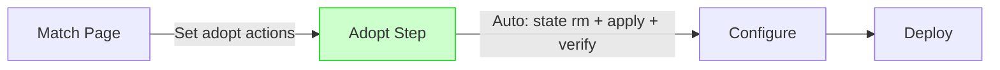
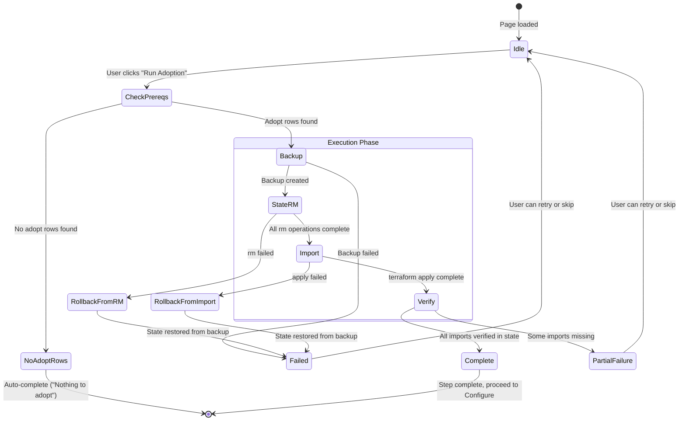

# PRD: Dedicated Adoption Terraform Step

**Status:** Ready for Implementation  
**Created:** 2026-02-11  
**Version:** 0.22.0+  
**Depends on:** [43.01 Part 1 — Migration Adoption](43.01-Import-Adopt-Workflow.md)

---

## Context

[PRD 43.01](43.01-Import-Adopt-Workflow.md) Part 1 defined the adoption workflow within the Migration flow: users set `action=adopt` on the Match page, generate import blocks, and then proceed to Deploy. However, the current implementation leaves a critical gap between the Match and Deploy steps.

Today, after configuring adoptions on the Match page:

1. The user clicks "Generate Import Blocks" to write `adopt_imports.tf`
2. The user must **manually** run `terraform state rm` for resources with mismatched IDs in state
3. The user must **manually** run `terraform apply` (or `terraform import` for TF < 1.5) to execute the imports
4. The user must **manually** verify the state is correct
5. Only then can the user proceed to Configure and Deploy

This manual sequence is error-prone, breaks the guided workflow experience, and is the single largest source of user friction in adoption. The protection workflow solved an analogous problem: protection changes are applied automatically as `moved {}` blocks in `protection_moves.tf` during the Generate phase on Deploy. Adoption should follow the same automation pattern.

### Current Pain Points

| Pain Point | Impact |
|------------|--------|
| Users must drop to CLI between UI steps | Breaks guided workflow; users lose context |
| `terraform state rm` is destructive and not reversible without backups | Risk of data loss if wrong resource removed |
| Import failures leave partial state that is hard to diagnose | Users get stuck with inconsistent TF state |
| No progress feedback during long import operations | Users don't know if operation is working or hung |
| Users must remember which resources need `state rm` vs direct import | Cognitive load; easy to make mistakes |

### Analogy with Protection Workflow

The protection workflow provides a strong pattern to follow:

| Aspect | Protection Workflow | Proposed Adoption Workflow |
|--------|--------------------|-----------------------------|
| **Trigger** | Protection flags changed on Match/Configure page | Adopt actions set on Match page |
| **Artifact** | `protection_moves.tf` (HCL `moved {}` blocks) | `adopt_imports.tf` (HCL `import {}` blocks) |
| **Generation** | During Deploy "Generate Terraform Files" step | During new Adopt step (before Configure) |
| **Execution** | Automatic during `terraform apply` on Deploy | Automatic during Adopt step apply |
| **Cleanup** | N/A (moved blocks are idempotent) | `adopt_imports.tf` removed after successful apply |
| **State safety** | Moved blocks are non-destructive | State backup before `state rm`; rollback on failure |

---

## Goal

Insert a dedicated **Adopt** step into the Migration workflow between **Match** (step 6) and **Configure** (step 7) that automates the `terraform state rm` + `terraform apply` (import) cycle. This step runs all necessary Terraform operations with real-time output streaming, state backup/rollback safety, and verification — eliminating the need for users to drop to the CLI.

## Non-Goals

- Changing the existing Match page adoption UX (action dropdowns, bulk actions, etc.)
- Implementing the standalone Import & Adopt workflow (Part 2 of 43.01)
- Adding new resource type support beyond what 43.01 Part 1 covers
- Modifying the protection workflow mechanics
- Supporting Terraform versions < 1.5 in the automated step (legacy CLI `terraform import` fallback remains manual)

---

## Current vs Proposed Flow

### Current Flow (Manual Adoption)

```mermaid
graph LR
    A[Match Page] -->|Set adopt actions| B[Generate Import Blocks]
    B -->|"adopt_imports.tf written"| C[Manual: terraform state rm]
    C -->|CLI| D[Manual: terraform apply]
    D -->|CLI| E[Manual: verify state]
    E -->|Return to UI| F[Configure]
    F --> G[Deploy]

    style C fill:#ffcccc,stroke:#cc0000
    style D fill:#ffcccc,stroke:#cc0000
    style E fill:#ffcccc,stroke:#cc0000
```



### Proposed Flow (Automated Adoption Step)



### Adopt Step Internal State Machine



### Full Migration Workflow Comparison

```mermaid
graph TD
    subgraph Current["Current Migration Steps"]
        C1[1. Fetch Source] --> C2[2. Explore Source]
        C2 --> C3[3. Select Source]
        C3 --> C4[4. Fetch Target]
        C4 --> C5[5. Explore Target]
        C5 --> C6[6. Match / Set Target Intent]
        C6 --> C7[7. Configure Migration]
        C7 --> C8[8. Target Credentials]
        C8 --> C9[9. Deploy]
    end

    subgraph Proposed["Proposed Migration Steps"]
        P1[1. Fetch Source] --> P2[2. Explore Source]
        P2 --> P3[3. Select Source]
        P3 --> P4[4. Fetch Target]
        P4 --> P5[5. Explore Target]
        P5 --> P6[6. Match / Set Target Intent]
        P6 --> P7["7. Adopt (NEW)"]
        P7 --> P8[8. Configure Migration]
        P8 --> P9[9. Target Credentials]
        P9 --> P10[10. Deploy]
    end

    style P7 fill:#ccffcc,stroke:#00cc00,stroke-width:3px
```



---

## User Stories

| ID | Story | Acceptance Criteria | BV |
|----|-------|---------------------|----|
| US-AS-01 | As a migration operator, I want adoption imports to execute automatically so I don't have to run terraform commands manually | Clicking "Run Adoption" on the Adopt page runs all necessary `state rm` and `apply` operations without CLI interaction | yes |
| US-AS-02 | As a migration operator, I want stale state entries removed before imports so mismatched IDs don't cause failures | When a resource's current state address differs from the target import address, `terraform state rm` runs on the old address before `terraform import` (via apply) adds the new one | yes |
| US-AS-03 | As a migration operator, I want to see real-time output of terraform operations so I know what's happening | Adopt step streams `terraform state rm`, `terraform apply`, and verification output to the UI in real-time (log panel with auto-scroll) | yes |
| US-AS-04 | As a migration operator, I want a state backup before destructive rm operations so I can recover from errors | Before any `terraform state rm`, the step copies `terraform.tfstate` to `terraform.tfstate.adopt-backup`. If the step fails, a "Restore Backup" button is available | yes |
| US-AS-05 | As a migration operator, I want the step to be skippable when no resources need adoption | When no rows have `action=adopt`, the Adopt step auto-completes with a "Nothing to adopt — all resources are new or ignored" message and enables navigation to Configure | yes |
| US-AS-06 | As a migration operator, I want adoption results verified after apply so I can confirm all imports succeeded | After `terraform apply`, the step runs `terraform state list` and cross-references with expected import addresses; reports success count vs expected count | yes |
| US-AS-07 | As a migration operator, I want to see a summary of what will happen before execution starts | Before "Run Adoption", a summary card shows: N resources to import, M resources needing `state rm` first, estimated time | yes |
| US-AS-08 | As a migration operator, I want `adopt_imports.tf` cleaned up after successful adoption so it doesn't interfere with future plans | After all imports verified, `adopt_imports.tf` is deleted from the deployment directory | yes |
| US-AS-09 | As a migration operator, I want to skip the Adopt step and run commands manually if I prefer | A "Skip — I'll handle imports manually" link bypasses the automated step and proceeds to Configure | yes |
| US-AS-10 | As a migration operator, I want the Adopt step to handle protected resource addresses correctly | Resources marked as protected use `protected_<type>` addresses for both `state rm` (if applicable) and import, consistent with the protection workflow | yes |

---

## Architectural Decisions

| ID | Decision | Rationale |
|----|----------|-----------|
| AD-AS-1 | **New workflow step**: `WorkflowStep.ADOPT` (value 19) inserted between MATCH and CONFIGURE in `WORKFLOW_STEPS[MIGRATION]` | Dedicated step provides clear UX boundary; reusable by Part 2; doesn't overload existing Match or Deploy pages |
| AD-AS-2 | **Step prerequisites**: Match complete + at least one `action=adopt` row + TF state loaded | Ensures user has made adoption decisions and state is available for cross-referencing; auto-skip when no adoptions needed |
| AD-AS-3 | **State backup before rm**: Copy `terraform.tfstate` to `terraform.tfstate.adopt-backup` | `terraform state rm` is destructive; backup enables rollback without requiring the user to have made their own backup; follows least-surprise principle |
| AD-AS-4 | **Sequential execution**: `state rm` for all mismatches first, then single `terraform apply` for all imports | Batching `state rm` operations avoids partial state issues; single `apply` leverages Terraform's dependency graph for correct import ordering |
| AD-AS-5 | **Reuse existing `generate_adopt_imports_from_grid()`** for import block generation | Function already handles all resource types, protection addresses, and module naming; no duplication needed |
| AD-AS-6 | **`adopt_imports.tf` lifecycle**: Written before apply, deleted after successful verify | Import blocks are one-time artifacts; leaving them in the config causes "already managed" errors on subsequent plans. Matches how protection `moved {}` blocks are idempotent but import blocks are not |
| AD-AS-7 | **Real-time output via subprocess streaming** | Reuse the same subprocess streaming pattern from `deploy.py` (`terraform plan`/`apply` output); provides familiar UX and consistent implementation |
| AD-AS-8 | **Skip-when-empty auto-completion** | If no adopt rows exist (all "create" or "ignore"), the step should show a brief message and allow immediate navigation forward; user should not be blocked by an empty step |
| AD-AS-9 | **Value 19 for ADOPT enum** | Value 19 is the next available after UTILITIES (18); avoids renumbering existing steps which would break persisted state references |
| AD-AS-10 | **Move `generate_adopt_imports` and `state rm` logic out of `match.py`** | Match page currently contains "Generate Import Blocks" and state removal buttons; these become implementation details of the Adopt step. Match page retains only action selection (the "what"); Adopt step handles execution (the "how") |

---

## Detailed Design

### Step Flow

1. **Page Load**
   - Read `confirmed_mappings` from `AppState.map` to determine adopt rows
   - Read `reconcile_state_resources` from `AppState.deploy` to identify state mismatches
   - Compute summary: N to import, M needing `state rm`, K already in state
   - If zero adopt rows → show "Nothing to adopt" message + auto-enable forward navigation

2. **Pre-Execution Summary**
   - Display card with counts: resources to import, resources needing state rm, protected resources
   - List each resource by type with its target ID and planned operation
   - "Run Adoption" primary button + "Skip" secondary link

3. **Execution** (triggered by "Run Adoption")
   - **Phase 1: Backup** — Copy `terraform.tfstate` → `terraform.tfstate.adopt-backup`
   - **Phase 2: State Removal** — For each resource with a mismatched state address, run `terraform state rm <old_address>` with output streamed to log panel
   - **Phase 3: Write Import Blocks** — Call `write_adopt_imports_file()` to generate `adopt_imports.tf`
   - **Phase 4: Init** — Run `terraform init` (in case providers changed)
   - **Phase 5: Apply** — Run `terraform apply -auto-approve` with output streamed to log panel
   - **Phase 6: Verify** — Run `terraform state list`, cross-reference with expected addresses

4. **Post-Execution**
   - **Success**: Show green summary, delete `adopt_imports.tf`, delete backup (optional), enable forward navigation
   - **Partial failure**: Show which imports succeeded/failed, offer "Retry Failed" or "Skip"
   - **Full failure**: Show error, offer "Restore Backup" + "Retry" or "Skip"

### State Mismatch Detection

A resource needs `terraform state rm` when:
- It exists in `terraform.tfstate` at address A
- The adoption target requires it at address B (different from A)
- Common case: resource was previously managed as `dbtcloud_job.jobs["key"]` but is being re-imported as `dbtcloud_job.jobs["new_key"]` (key changed due to renaming)

The mismatch detection reuses `AppState.deploy.reconcile_state_resources` (populated by `load_terraform_state()`) cross-referenced with the import addresses computed by `generate_adopt_imports_from_grid()`.

### UI Layout

```
┌─────────────────────────────────────────────────────────┐
│  Adopt Resources into Terraform State                    │
│                                                          │
│  ┌──────────────────────────────────────────────────┐   │
│  │  Summary                                          │   │
│  │  • 12 resources to import                         │   │
│  │  • 3 resources need state rm first (ID mismatch)  │   │
│  │  • 2 protected resources (using protected_ addr)  │   │
│  │  • Estimated time: ~30 seconds                    │   │
│  └──────────────────────────────────────────────────┘   │
│                                                          │
│  ┌──────────────────────────────────────────────────┐   │
│  │  Resources to Adopt                               │   │
│  │  ─────────────────────────────────────────────── │   │
│  │  PRJ  Analytics          (ID: 12345)  import      │   │
│  │  ENV  Production         (ID: 67890)  import      │   │
│  │  JOB  Daily Refresh      (ID: 11111)  rm + import │   │
│  │  ...                                              │   │
│  └──────────────────────────────────────────────────┘   │
│                                                          │
│  [ Run Adoption ]          Skip — I'll handle manually → │
│                                                          │
│  ┌──────────────────────────────────────────────────┐   │
│  │  Execution Log (hidden until running)             │   │
│  │  ─────────────────────────────────────────────── │   │
│  │  > Backing up terraform.tfstate...          ✓     │   │
│  │  > terraform state rm module.dbt_cloud...   ✓     │   │
│  │  > Writing adopt_imports.tf (12 blocks)...  ✓     │   │
│  │  > terraform init...                        ✓     │   │
│  │  > terraform apply -auto-approve...               │   │
│  │    module.dbt_cloud.dbtcloud_project...  imported  │   │
│  │    module.dbt_cloud.dbtcloud_environment... imported│   │
│  │  > Verifying state...                       ✓     │   │
│  │                                                   │   │
│  │  ✓ All 12 resources imported successfully         │   │
│  └──────────────────────────────────────────────────┘   │
└─────────────────────────────────────────────────────────┘
```

---

## Files to Change

| File | Action | Notes |
|------|--------|-------|
| `importer/web/state.py` | Modify | Add `WorkflowStep.ADOPT = 19`; update `STEP_NAMES`, `STEP_ICONS`; insert into `WORKFLOW_STEPS[MIGRATION]` between MATCH and CONFIGURE; add `AdoptState` dataclass to `DeployState` or `MapState` for tracking execution progress |
| `importer/web/app.py` | Modify | Register `/adopt` route pointing to `adopt_page()` |
| `importer/web/pages/adopt.py` | Create | New page implementing the Adopt step UI and execution logic |
| `importer/web/pages/match.py` | Modify | Remove "Generate Import Blocks" button/handler and "Run State Removal" button/handler (moved to Adopt step); keep action selection UI unchanged |
| `importer/web/utils/terraform_import.py` | Reference | Reuse `generate_adopt_imports_from_grid()`, `write_adopt_imports_file()` — no changes needed |
| `importer/web/utils/terraform_state_reader.py` | Reference | Reuse `read_terraform_state()`, `parse_state_json()` — no changes needed |
| `importer/web/utils/protection_manager.py` | Reference | Reuse `get_resource_address()` for protected address resolution — no changes needed |
| `importer/web/components/match_grid.py` | Reference | Reuse `build_grid_data()` to read confirmed_mappings — no changes needed |
| `importer/web/components/stepper.py` | Modify | Update step numbering display to accommodate new ADOPT step |

---

## Test Plan

### Unit Tests

| Test ID | Test Case | Expected Result |
|---------|-----------|-----------------|
| UT-AS-01 | `WorkflowStep.ADOPT` exists with value 19 | Enum value is 19; `STEP_NAMES[ADOPT]` = "Adopt Resources"; `STEP_ICONS[ADOPT]` = "download_for_offline" |
| UT-AS-02 | `WORKFLOW_STEPS[MIGRATION]` includes ADOPT between MATCH and CONFIGURE | Step list is `[..., MATCH, ADOPT, CONFIGURE, ...]` |
| UT-AS-03 | State backup creates `terraform.tfstate.adopt-backup` | Given a `terraform.tfstate` file, backup function creates a copy with `.adopt-backup` suffix |
| UT-AS-04 | State restore replaces `terraform.tfstate` from backup | Restore function copies `.adopt-backup` back to `terraform.tfstate`; original state is replaced |
| UT-AS-05 | Mismatch detection identifies resources needing `state rm` | Given state with resource at address A and import targeting address B, mismatch detector returns the old address for removal |
| UT-AS-06 | Mismatch detection returns empty list when addresses match | Given state with resource at address A and import targeting same address A, no `state rm` needed |
| UT-AS-07 | Summary computation counts adopt rows correctly | Given grid with 5 adopt, 3 ignore, 2 create rows → summary shows 5 to import |
| UT-AS-08 | Summary computation identifies protected adopt rows | Given grid with 2 protected adopt rows → summary shows 2 protected |
| UT-AS-09 | Skip-when-empty logic detects zero adopt rows | Given grid with all "create" and "ignore" rows → `has_adopt_rows` returns False |
| UT-AS-10 | `adopt_imports.tf` cleanup function removes file | Given existing `adopt_imports.tf` → cleanup function deletes it; non-existent file is a no-op |
| UT-AS-11 | Verification cross-references state list with expected addresses | Given state list output and expected addresses → verification returns success/failure per address |
| UT-AS-14 | Protection guard: ignored resource returns "dialog_needed" | Given row with action=ignore, guard function returns dialog_needed rather than toggling directly |
| UT-AS-15 | Protection guard: adopted resource toggles directly | Given row with action=adopt, protection toggles without guard dialog |
| UT-AS-16 | Adopt-and-protect sets both fields in grid and confirmed_mappings | After "Yes" path, verify action=adopt and protected=True in row and confirmed_mappings |
| UT-AS-17 | Unprotect works regardless of action | Removing protection (shield already on) works for both adopted and ignored rows |
| UT-AS-18 | Protection changes re-enable Plan button | Verify protection toggle triggers the same re-plan logic as action changes |
| UT-AS-19 | Protected adopt rows generate `protected_*` import addresses | Given adopt row with protected=True, import block uses `protected_projects` address |

### Integration Tests

| Test ID | Test Case | Expected Result |
|---------|-----------|-----------------|
| IT-AS-01 | Full adopt step execution: backup → rm → write imports → init → apply → verify | All phases complete in order; state contains imported resources; `adopt_imports.tf` cleaned up |
| IT-AS-02 | Adopt step with state mismatches: resources at wrong addresses | `state rm` removes old addresses; apply imports at new addresses; verification passes |
| IT-AS-03 | Adopt step with no mismatches: clean import only | No `state rm` operations; apply imports successfully; verification passes |
| IT-AS-04 | Adopt step rollback on apply failure | Apply fails → state restored from backup → user sees error with "Restore Backup" confirmation |
| IT-AS-05 | Adopt step with protected resources | Protected resources use `protected_<type>` addresses in both `state rm` and import blocks |
| IT-AS-06 | Adopt step skip-when-empty | Zero adopt rows → step auto-completes → forward navigation enabled |

### E2E / Browser Tests

| Test ID | Test Case | Expected Result |
|---------|-----------|-----------------|
| E2E-AS-01 | Navigate to Adopt page from Match → see summary card with correct counts | Summary card shows N to import, M to rm, K protected |
| E2E-AS-02 | Click "Run Adoption" → see real-time log output | Execution log panel appears with streaming output from each phase |
| E2E-AS-03 | Successful adoption → green summary → forward navigation enabled | After completion, success message visible; "Next" button navigates to Configure |
| E2E-AS-04 | Adopt step with zero adopt rows → auto-skip message | Page shows "Nothing to adopt" message; forward navigation immediately available |
| E2E-AS-05 | Click "Skip" link → navigate to Configure without execution | Skip bypasses all Terraform operations; Configure page loads normally |
| E2E-AS-06 | Adopt step failure → error message → "Restore Backup" button visible | On failure, error details shown; backup restore button available; retry button available |
| E2E-AS-07 | Full flow: Match adopt → Adopt step → Configure → Deploy | End-to-end workflow with automated adoption step completes without CLI interaction |
| E2E-AS-08 | Shield click on ignored resource shows adopt-and-protect dialog | Navigate to Adopt, find ignored resource, click shield → dialog appears with expected message |
| E2E-AS-09 | Dialog Yes sets adopt+protect; No leaves unchanged | Click Yes → row shows Adopt + shield active; Click No → row stays Ignore, no shield |
| E2E-AS-10 | Shield click on adopted resource toggles protection directly | Click shield on adopted row → protection toggles without dialog |
| E2E-AS-11 | Protected adopt plan targets `protected_*` block | Set resource to adopt+protect, run plan → plan output contains `protected_projects` (or equivalent) in import address |

---

## Acceptance Criteria

### Must Have

- [ ] `WorkflowStep.ADOPT` (value 19) added to enum with name, icon, and step list insertion
- [ ] New `/adopt` page registered and accessible from navigation
- [ ] Adopt step appears between Match and Configure in the Migration workflow stepper
- [ ] Summary card shows correct counts (resources to import, needing `state rm`, protected)
- [ ] "Run Adoption" executes backup → state rm → write imports → init → apply → verify
- [ ] Real-time output streaming for all Terraform operations
- [ ] State backup created before any destructive operation
- [ ] Rollback available on failure (restore from backup)
- [ ] Verification cross-references `terraform state list` with expected import addresses
- [ ] `adopt_imports.tf` cleaned up after successful adoption
- [ ] Skip-when-empty: auto-complete with message when no adopt rows exist
- [ ] Protected resources use correct `protected_<type>` addresses throughout
- [ ] "Generate Import Blocks" and "Run State Removal" removed from Match page (moved to Adopt step)

#### Phase 5: Protection Integration

- [ ] Protection column (shield) is clickable on the Adopt page
- [ ] Clicking shield on an ignored resource shows "Adopt and Protect?" dialog
- [ ] Yes in dialog sets both action=adopt and protected=true
- [ ] No in dialog dismisses with no state change
- [ ] Clicking shield on an adopted resource toggles protection directly (no dialog)
- [ ] Protected resources are imported into `protected_*` TF blocks (e.g., `protected_projects`)
- [ ] Unprotected resources are imported into regular TF blocks (e.g., `projects`)
- [ ] Protection changes re-enable the Plan Adoption button
- [ ] Protected count in summary cards updates reactively
- [ ] Match page: clicking shield on a target-only ignored resource shows the same dialog guard
- [ ] Protection intent is persisted to `protection-intent.json` via `ProtectionIntentManager`

### Should Have

- [ ] "Skip — I'll handle manually" link for users who prefer CLI
- [ ] Estimated execution time in summary card
- [ ] Partial failure handling: show which imports succeeded/failed; offer retry for failed
- [ ] Execution phase progress indicators (backup ✓, state rm ✓, apply ▶, verify ...)
- [ ] Resource-level detail in summary (expandable list showing each resource and planned operation)

### Nice to Have

- [ ] "Restore Backup" button available even after navigating away (if backup file exists)
- [ ] Execution log downloadable as text file
- [ ] Adopt step history (record of previous runs in session)
- [ ] Dry-run mode: show what would happen without executing

---

## Implementation Phases

### Phase 1: Workflow Step Registration

- Add `WorkflowStep.ADOPT = 19` to enum
- Add to `STEP_NAMES`, `STEP_ICONS`
- Insert into `WORKFLOW_STEPS[MIGRATION]` between MATCH and CONFIGURE
- Update `stepper.py` if step numbering display needs adjustment
- Unit tests: UT-AS-01, UT-AS-02
- **Done when:** Adopt step appears in stepper between Match and Configure; clicking it navigates to `/adopt`

### Phase 2: Adopt Page — Summary & Skip

- Create `importer/web/pages/adopt.py` with page scaffold
- Register route in `app.py`
- Implement summary card reading from `confirmed_mappings` and `reconcile_state_resources`
- Implement skip-when-empty auto-completion
- Implement "Skip" manual link
- Unit tests: UT-AS-07, UT-AS-08, UT-AS-09
- E2E tests: E2E-AS-01, E2E-AS-04, E2E-AS-05
- **Depends on:** Phase 1
- **Done when:** Adopt page shows correct summary; auto-skips when empty; "Skip" link works

### Phase 3: Adopt Page — Execution Engine

- Implement state backup (copy `terraform.tfstate`)
- Implement `state rm` execution with subprocess streaming
- Reuse `write_adopt_imports_file()` for import block generation
- Implement `terraform init` + `terraform apply -auto-approve` with streaming
- Implement verification via `terraform state list`
- Implement `adopt_imports.tf` cleanup
- Implement rollback (restore backup on failure)
- Unit tests: UT-AS-03, UT-AS-04, UT-AS-05, UT-AS-06, UT-AS-10, UT-AS-11
- Integration tests: IT-AS-01 through IT-AS-06
- E2E tests: E2E-AS-02, E2E-AS-03, E2E-AS-06
- **Depends on:** Phase 2
- **Done when:** "Run Adoption" executes full cycle; real-time output visible; rollback works on failure

### Phase 4: Match Page Cleanup & End-to-End

- Remove "Generate Import Blocks" button and handler from `match.py`
- Remove "Run State Removal" button and handler from `match.py`
- Keep adoption action selection UI intact (dropdowns, bulk actions, etc.)
- E2E test: E2E-AS-07
- **Depends on:** Phase 3
- **Done when:** Full Match → Adopt → Configure → Deploy flow works without CLI

---

## Ralph Wiggum Tasking

### Suggested Criterion Ordering

1. **Enum and routing** — fast, no server required, validates plumbing
2. **Summary and skip** — page scaffold with read-only logic
3. **Execution engine** — core Terraform automation
4. **Match page cleanup** — remove migrated UI elements
5. **E2E validation** — full browser flow

### Phase 1: Workflow Step Registration — RALPH_TASK Criteria

| # | Criterion | test_command | browser_validation |
|---|-----------|-------------|-------------------|
| 1 | `WorkflowStep.ADOPT = 19` exists; `STEP_NAMES`, `STEP_ICONS` populated; `WORKFLOW_STEPS[MIGRATION]` includes ADOPT between MATCH and CONFIGURE | `pytest importer/web/tests/ -v -k "UT_AS_01 or UT_AS_02"` | false |
| 2 | `/adopt` route registered; Adopt step visible in stepper between Match and Configure | browsermcp: navigate to stepper, verify step order | true |

### Phase 2: Summary & Skip — RALPH_TASK Criteria

| # | Criterion | test_command | browser_validation |
|---|-----------|-------------|-------------------|
| 3 | Summary card reads `confirmed_mappings` and shows correct counts (import, rm, protected) | `pytest importer/web/tests/ -v -k "UT_AS_07 or UT_AS_08"` | false |
| 4 | Skip-when-empty auto-completes with "Nothing to adopt" message | `pytest importer/web/tests/ -v -k "UT_AS_09"` | false |
| 5 | Adopt page summary visible in browser; "Skip" link navigates to Configure | browsermcp: navigate to /adopt, verify summary, click skip | true |

### Phase 3: Execution Engine — RALPH_TASK Criteria

| # | Criterion | test_command | browser_validation |
|---|-----------|-------------|-------------------|
| 6 | State backup creates `.adopt-backup`; restore replaces original | `pytest importer/web/tests/ -v -k "UT_AS_03 or UT_AS_04"` | false |
| 7 | Mismatch detection identifies resources needing `state rm` | `pytest importer/web/tests/ -v -k "UT_AS_05 or UT_AS_06"` | false |
| 8 | Verification cross-references `terraform state list` with expected addresses | `pytest importer/web/tests/ -v -k "UT_AS_11"` | false |
| 9 | `adopt_imports.tf` cleanup removes file after success | `pytest importer/web/tests/ -v -k "UT_AS_10"` | false |
| 10 | "Run Adoption" executes full cycle with real-time output in browser | browsermcp: click "Run Adoption", verify streaming log, verify success | true |
| 11 | Failure scenario: apply fails → error shown → "Restore Backup" available | browsermcp: simulate failure, verify error UI, verify backup restore | true |

### Phase 4: Match Page Cleanup & E2E — RALPH_TASK Criteria

| # | Criterion | test_command | browser_validation |
|---|-----------|-------------|-------------------|
| 12 | "Generate Import Blocks" and "Run State Removal" removed from Match page | browsermcp: navigate to Match, verify buttons absent | true |
| 13 | Full flow: Match adopt → Adopt step → Configure → Deploy | browsermcp: end-to-end flow (E2E-AS-07) | true |

### Phase 5: Protection Integration — RALPH_TASK Criteria

| # | Criterion | test_command | browser_validation |
|---|-----------|-------------|-------------------|
| 14 | Shield column clickable on Adopt page; toggles protection for adopted rows | `pytest importer/web/tests/ -v -k "adopt_protection"` | true |
| 15 | Adopt-to-protect dialog appears for ignored rows; Yes adopts+protects, No dismisses | browsermcp: click shield on ignored resource, verify dialog, click Yes/No | true |
| 16 | Match page guard blocks protection on ignored target-only resources | browsermcp: navigate to Match, click shield on ignored target-only, verify dialog | true |
| 17 | Plan targets correct `protected_*` or regular TF address based on protection flag | `pytest importer/web/tests/ -v -k "protected_adopt"` | false |
| 18 | Full flow: set adopt + protect on Adopt page → Plan → verify `protected_projects` in plan output | browsermcp: end-to-end protection adopt flow (E2E-AS-11) | true |

### Criterion Numbering Summary

| Criteria | Phase | Type | Count |
|----------|-------|------|-------|
| 1 | 1: Registration | unit | 1 |
| 2 | 1: Registration | E2E | 1 |
| 3–4 | 2: Summary & Skip | unit | 2 |
| 5 | 2: Summary & Skip | E2E | 1 |
| 6–9 | 3: Execution Engine | unit | 4 |
| 10–11 | 3: Execution Engine | E2E | 2 |
| 12 | 4: Cleanup | E2E | 1 |
| 13 | 4: Cleanup | E2E | 1 |
| 14–15 | 5: Protection Integration | E2E | 2 |
| 16 | 5: Protection Integration | E2E | 1 |
| 17 | 5: Protection Integration | unit | 1 |
| 18 | 5: Protection Integration | E2E | 1 |
| **Total** | | | **18** |

### Phase 5: Protection Integration

- Wire protection intent into the Adopt step so users can toggle `protected` status directly on the Adopt page
- Shield column becomes clickable: clicking on an adopted resource toggles protection directly; clicking on an ignored resource shows a "Protection Requires Adoption" dialog
- Same guard added to Match page: clicking the shield on a target-only ignored resource shows the adopt-and-protect dialog
- ProtectionIntentManager loaded on Adopt page init; decisions persist to `protection-intent.json` and sync with Match page via `state.map.protected_resources`
- During plan pipeline Phase 3, `apply_protection_from_set()` is called after config injection to stamp `protected: true` on adopted YAML entries
- Import addresses automatically target `protected_*` or regular TF blocks based on the `protected` flag on each row
- Protection changes invalidate stale plans (re-enable Plan Adoption button)
- Protected count in summary card updates reactively on toggle
- Unit tests: UT-AS-14 through UT-AS-19
- E2E tests: E2E-AS-08 through E2E-AS-11
- **Depends on:** Phase 3
- **Done when:** Shield column is interactive on Adopt page; dialog guard works on both pages; plan targets correct protected/unprotected blocks

---

## Risk Assessment

| Risk | Likelihood | Impact | Mitigation |
|------|-----------|--------|------------|
| `terraform state rm` removes wrong resource | Low | High | State backup before any rm; verification after apply; user confirmation before execution |
| `terraform apply` fails mid-import (partial state) | Medium | Medium | Backup enables rollback; partial failure UI shows what succeeded vs failed |
| Long execution time for large resource sets | Medium | Low | Real-time output streaming keeps user informed; estimated time in summary |
| Terraform version incompatibility | Low | Medium | Detect TF version at step start; fall back to manual skip for < 1.5 |
| State file corruption | Very Low | High | Backup file; recommend `terraform state pull` for remote backends |

---

## Open Questions

1. **Remote state backends**: For users with S3/GCS/Consul backends, `terraform state rm` and `terraform state list` still work via the backend, but the backup mechanism (file copy) only works for local state. Should we support `terraform state pull`/`terraform state push` for remote backends?

2. **Concurrent state access**: If multiple users share a remote state backend, the adopt step could conflict with other operations. Should we add state locking warnings?

3. **Terraform Cloud/Enterprise**: For users running TF through TFC/TFE, subprocess-based `terraform` commands may not be appropriate. Should the step detect this and offer alternative guidance?

---

## Governance

This PRD is subject to the **Workflow Governance** rules in
[0.17 of 00.01-Standards-of-Development.md](00.01-Standards-of-Development.md#017-workflow-governance--reuse-first--test-gates).

---

## Post-Implementation Note (2026-03-03)

The migration utility route `/removal-management` has been expanded and labeled
**State Management** to include refresh-only state sync operations in addition
to state-removal operations.

- **Refresh-only (new):** supports full-state refresh and targeted selected-row refresh.
- **State removal (existing):** existing `terraform state rm` workflow remains available.
- **Plan viewer parity:** refresh plan output uses the same style viewer interaction used elsewhere.

This does not replace the dedicated Adopt step from this PRD; it adds a utility
surface for explicit Terraform state maintenance tasks outside the adopt flow.

---

## Navigation

- [43.01-Import-Adopt-Workflow.md](43.01-Import-Adopt-Workflow.md) — Parent PRD: Adoption workflow & import (Part 1 & 2)
- [43.03-Unified-Protect-Adopt-Pipeline.md](43.03-Unified-Protect-Adopt-Pipeline.md) — **Unified Protect & Adopt Pipeline** (supersedes per-page generation with headless pipeline)
- [42.01-Global-Resources-Target-Intent.md](42.01-Global-Resources-Target-Intent.md) — Global resource handling patterns
- [31.02-Resource-Protection.md](31.02-Resource-Protection.md) — Protection system architecture (analogous `moved {}` pattern)
- [41.02-Adding-New-Terraform-Object-Support.md](41.02-Adding-New-Terraform-Object-Support.md) — Resource type support checklist
- [docs/architecture/canonical-contracts.md](../docs/architecture/canonical-contracts.md) — Canonical workflow contracts
