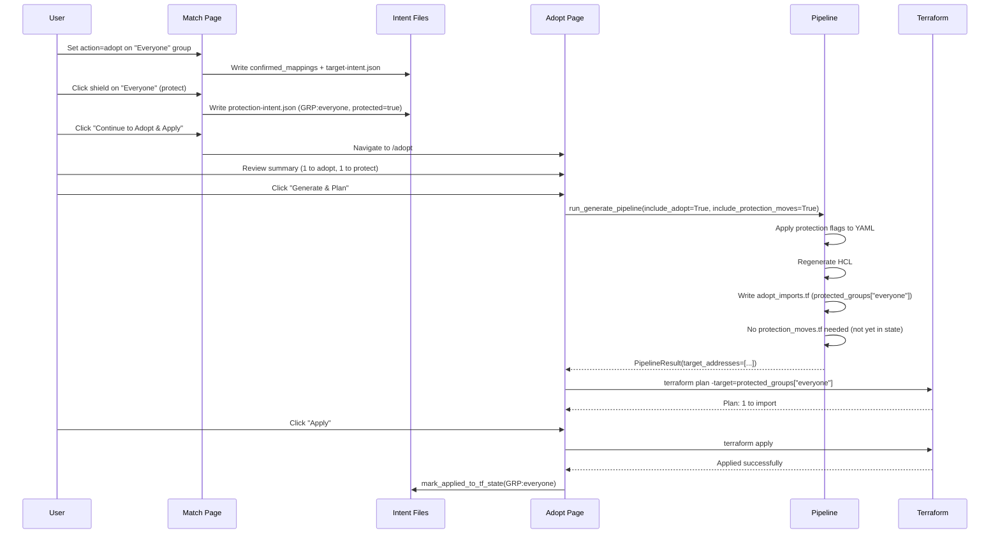
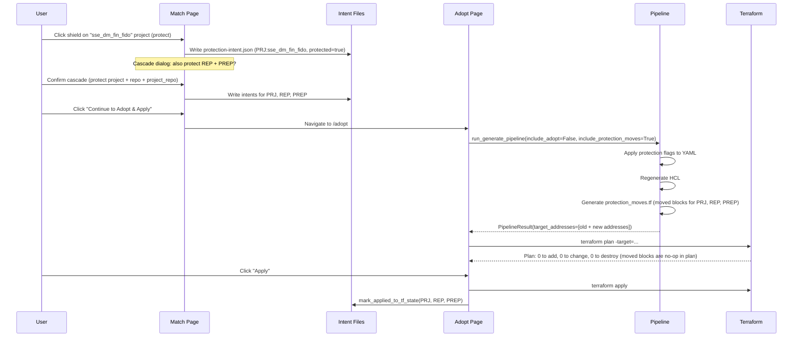
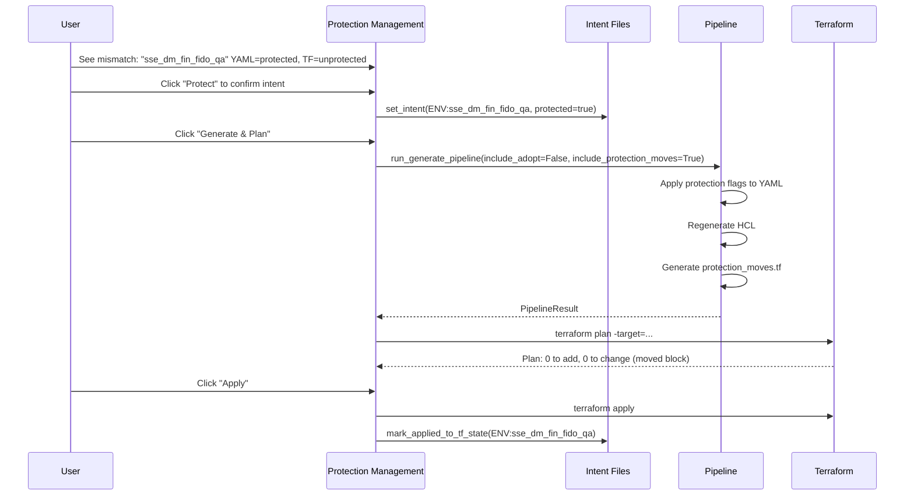
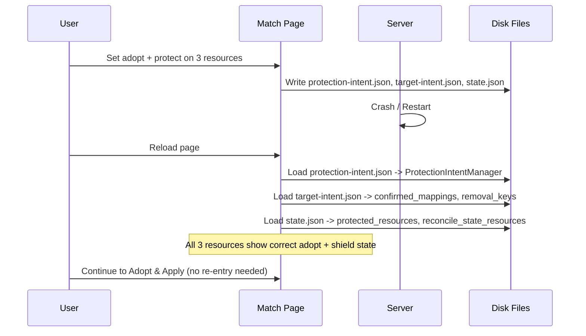
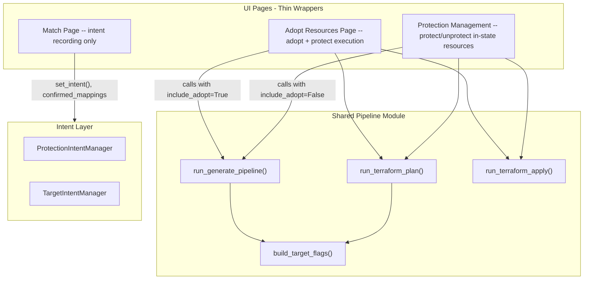

# PRD: Unified Protect & Adopt Pipeline

**Status:** Implemented (execution centralized; regression hardening complete)  
**Created:** 2026-02-14  
**Version:** 0.23.0+  
**Depends on:** [43.01 — Adoption Workflow](43.01-Import-Adopt-Workflow.md), [43.02 — Adoption Terraform Step](43.02-Adoption-Terraform-Step.md), [31.02 — Resource Protection](31.02-Resource-Protection.md)

---

## Implementation Status (2026-02-18)

Delivered:

- Adopt execution is pipeline-based (`run_generate_pipeline`) with scoped targeting.
- Utilities protection generation is pipeline-based (`include_adopt=False`).
- Match remains intent-oriented with execution routed to Adopt.
- `removal_keys` persistence is in place in app state.
- Adopt/deploy regressions are covered by focused tests:
  - adopt-only baseline merge scope,
  - unadopt artifact invalidation,
  - zero-adopt YAML reset behavior,
  - source-vs-terraform count semantics.

Post-debug cleanup:

- Session debug hooks were disabled in runtime codepaths (`adopt.py`, `deploy.py`, `generate_pipeline.py`).

---

## Context

PRDs 43.01 and 43.02 defined the adoption workflow and the dedicated adoption terraform step. PRD 31.02 defined the protection workflow. In practice, these three workflows are deeply intertwined: adopting a resource often requires protecting it, and protection changes require terraform plan/apply cycles that interact with adoption import blocks.

The current implementation splits execution logic across **three pages**, each with its own generation code path:

- **Match page** (`match.py` ~850 lines): `do_generate_work()` merges baseline YAML, applies ALL protection intents, regenerates HCL, generates `protection_moves.tf`, updates `adopt_imports.tf`, runs terraform init/plan/apply with `-target` flags
- **Adopt page** (`adopt.py` ~300 lines): `_run_adopt_plan()` injects configs, applies protection from in-memory set, writes `adopt_imports.tf`, renames `protection_moves.tf` aside, runs terraform plan/apply
- **Utilities page** (`utilities.py` ~50 lines): `generate_all_pending()` applies ONLY pending intents to YAML, calls a different moved-block function (`generate_moved_blocks_from_state` vs `generate_repair_moved_blocks`), no HCL regeneration, no terraform execution

### Root Cause of Repeated Regressions

Each page has its own bugs. Fixing one path does not fix the others. Changes to shared state files (`protection-intent.json`, YAML configs, terraform state) create cascading failures because the three code paths make different assumptions about what has already been done.

Historical bug classes:
- YAML protection flags wiped by baseline merge (match page applied them, then re-merged baseline)
- `protection_moves.tf` generated moved blocks for resources not yet in terraform state
- `adopt_imports.tf` targeted wrong block (groups instead of protected_groups) when protection intent changed
- Lost `-target` flags because neither `protection_moves.tf` nor `adopt_imports.tf` addresses were included
- Intent key mismatch (`GRP:target__everyone` vs `GRP:everyone`) between recording and lookup
- `old_protected` calculation in `on_row_change` disagreed with grid rendering logic after server restart

### State Persistence Gap

Audit of `AppState` persistence revealed one HIGH-severity gap:

| Field | Persisted | Location | Survives Restart | Severity |
|-------|-----------|----------|------------------|----------|
| `map.protected_resources` | Yes | state.json | Yes (with project) | None |
| `map.confirmed_mappings` | Yes | state.json + target-intent.json | Yes | None |
| `map.removal_keys` | **No** | Not persisted | **No** | **HIGH** |
| `deploy.reconcile_state_resources` | Yes | state.json | Yes | None |
| `deploy.terraform_dir` | Yes | state.json | Yes | None |
| `deploy.adopt_step_complete` | Yes | target-intent.json | Yes | None |
| `deploy.adopt_step_status` | No | In-memory | No | Low (transient) |
| Protection intents | Yes | protection-intent.json | Yes | None |
| Target intents | Yes | target-intent.json | Yes | None |

The `removal_keys` gap means unadopt decisions are lost on server restart.

---

## Goal

Extract a single, headless protection+adoption generation pipeline that all pages call, eliminating duplicated logic and enabling comprehensive automated testing. Ensure all relevant state survives server restarts.

## Non-Goals

- Changing the user-facing workflow steps or navigation order
- Removing or deprecating the Protection Management (Utilities) page
- Changing the protection intent or target intent JSON schemas
- Adding new resource types to the protection system
- Remote state backend support (see Open Questions)

---

## User Stories

| ID | Story | Acceptance Criteria | BV |
|----|-------|--------------------|----|
| US-1 | As a migration engineer, I want to adopt target resources into Terraform on the Adopt page, so that all adoption execution happens in one place | Adopt page runs import blocks and state rm, shows plan/apply output | High |
| US-2 | As a migration engineer, I want to protect resources during adoption on the Adopt page, so that protection and adoption are a single plan/apply step | Adopt page generates both `adopt_imports.tf` and `protection_moves.tf`, targets both in plan | High |
| US-3 | As a migration engineer, I want to set protection intent on the Match page, so that I can decide what to protect before executing changes | Shield clicks record intent to `protection-intent.json`, action changes clear protection, guard dialog appears for target-only resources | High |
| US-4 | As a migration engineer, I want my protection and adoption decisions to survive server restarts, so that I don't lose work | All intents persisted to JSON files, `removal_keys` persisted, state restored on reload | High |
| US-5 | As a migration engineer, I want to protect/unprotect already-in-state resources from the Protection Management page, so that I can fix protection mismatches without going through the adoption flow | Utilities page runs the same pipeline with `include_adopt=False`, has its own plan/apply | Medium |
| US-6 | As a migration engineer, I want the Match page to NOT run terraform, so that I can make decisions without accidentally applying changes | Match page has no terraform buttons, only "Continue to Adopt & Apply" navigation | Medium |
| US-7 | As a migration engineer, I want the plan to be scoped (targeted) to only the resources I'm changing, so that unrelated drift doesn't appear | Pipeline builds `-target` flags from both `protection_moves.tf` and `adopt_imports.tf` | High |
| US-8 | As a developer, I want automated tests covering every action/protection/drift combination, so that regressions are caught before they reach the UI | Test harnesses pass in CI, covering the full combination matrix | High |

---

## User Journeys

### Journey 1: Adopt and Protect a New Resource

The most common flow -- a resource exists in the target account but is not in terraform state.



### Journey 2: Protect an Already-Adopted Resource

A resource is already in terraform state (in_sync) but needs to move to the protected block.



### Journey 3: Fix Protection Mismatch from Utilities Page

A resource's YAML says protected but terraform state has it in the unprotected block.



### Journey 4: Server Restart Resilience



---

## Full Combination Matrix

### Dimensions

- **Actions** (6): match, adopt, ignore, skip, create_new, unadopt
- **Protection states** (2): protected, unprotected
- **Drift statuses** (6): in_sync, not_in_state, id_mismatch, attr_mismatch, state_only, no_state

### Shield Visibility Rules

| Action | Shield Visible | Notes |
|--------|---------------|-------|
| match | Yes | Direct toggle |
| adopt | Yes | Direct toggle |
| ignore | No | Suppressed -- cannot protect ignored resources |
| skip | No | Suppressed |
| create_new | No | Suppressed |
| unadopt | No | Suppressed |

### Shield Click Outcomes (Match Page)

| Action | Protected | Drift | Click Result |
|--------|-----------|-------|-------------|
| match | No | in_sync | Record protect intent, show shield |
| match | Yes | in_sync | Record unprotect intent, clear shield (cascade dialog if children) |
| adopt | No | not_in_state | Record protect intent, show shield |
| adopt | Yes | not_in_state | Record unprotect intent, clear shield |
| adopt | No | id_mismatch | Record protect intent, show shield |
| match | No | not_in_state (target-only) | "Protection Requires Adoption" guard dialog |
| -- | -- | -- | Yes -> set action=adopt + protected=true, record both intents |
| -- | -- | -- | No -> revert protection, leave action unchanged |

### Action Change Side Effects

| From | To | Protection Side Effect |
|------|----|----------------------|
| adopt + protected | ignore | MUST clear protection intent + shield + protected_resources |
| adopt + protected | skip | MUST clear protection intent + shield + protected_resources |
| adopt + protected | unadopt | MUST clear protection intent + shield, add to removal_keys |
| adopt + protected | create_new | MUST clear protection intent + shield + protected_resources |
| match + protected | ignore | MUST clear protection intent + shield + protected_resources |
| match + protected | unadopt | MUST clear protection intent + shield, add to removal_keys |
| ignore | adopt | No auto-protect (user must click shield separately) |
| any | match | No protection change |

### Terraform Artifacts by Combination

| Action | Drift | Protected | Import Block | State RM | Moved Block |
|--------|-------|-----------|-------------|----------|-------------|
| adopt | not_in_state | No | `groups["x"]` | No | No |
| adopt | not_in_state | Yes | `protected_groups["x"]` | No | No |
| adopt | id_mismatch | No | `groups["x"]` | Yes | No |
| adopt | id_mismatch | Yes | `protected_groups["x"]` | Yes | No |
| adopt | attr_mismatch | No | `groups["x"]` | No | No |
| adopt | attr_mismatch | Yes | `protected_groups["x"]` | No | No |
| adopt | in_sync | No | No (skip) | No | No |
| adopt | in_sync | Yes | No (skip) | No | Yes (move to protected) |
| match | in_sync | protect change | No | No | Yes |
| match | in_sync | no change | No | No | No |
| ignore | any | any | No | No | No |
| skip | any | any | No | No | No |
| create_new | any | any | No | No | No |
| unadopt | any | any | No | removal_keys | No |

---

## Architecture

### Target Architecture



### Pipeline Module: `importer/web/utils/generate_pipeline.py`

```python
@dataclass
class PipelineResult:
    yaml_updated: bool
    hcl_regenerated: bool
    moves_file: Optional[Path]       # protection_moves.tf
    imports_file: Optional[Path]     # adopt_imports.tf
    target_addresses: list[str]      # for -target flags
    errors: list[str]
    intents_applied: list[str]       # keys marked applied

async def run_generate_pipeline(
    state: AppState,
    *,
    include_adopt: bool = False,
    adopt_rows: list[dict] | None = None,
    include_protection_moves: bool = True,
    merge_baseline: bool = True,
    regenerate_hcl: bool = True,
    on_progress: Callable[[str], None] | None = None,
    is_cancelled: Callable[[], bool] | None = None,
) -> PipelineResult:
```

**Pipeline steps (single sequence, no branching per page):**

1. Resolve paths (`tf_path`, `yaml_file`, `baseline_yaml_path`)
2. Merge baseline (if `merge_baseline`)
3. Apply ALL protection flags from `get_all_intents()` + `get_pending_yaml_updates()`
4. Regenerate HCL (if `regenerate_hcl`)
5. Generate `protection_moves.tf` (if `include_protection_moves`) -- build ProtectionMismatch list, filter by TF state, expand PRJ to REP/PREP
6. Generate `adopt_imports.tf` (if `include_adopt`)
7. Update `adopt_imports.tf` addresses if protection changed for adopted resources
8. Mark intents applied to YAML
9. Build target addresses from both `.tf` files
10. Return `PipelineResult`

### Shared Terraform Helpers: `importer/web/utils/terraform_helpers.py`

- `resolve_deployment_paths(state) -> (tf_path, yaml_file, baseline_path)`
- `get_terraform_env(state) -> dict`
- `build_target_flags(tf_path, protection_intent_manager) -> list[str]`
- `run_terraform_command(cmd, tf_path, env, on_output) -> (returncode, stdout, stderr)`

---

## Detailed Design

### What Stays on Match Page

All intent recording and display (no changes needed):
- `on_row_change()` protection toggle logic
- `apply_protection()` / `remove_protection()` bulk intent
- Cascade dialogs (protect/unprotect with children/parents)
- Adopt intent recording in grid dropdowns
- `_adopt_and_protect_from_match()` guard dialog
- Protection Intent Status panel (read-only display with clarification buttons)
- Pending Intents section with Undo buttons

### What Gets Removed from Match Page

All generation and terraform execution (~850 lines):
- `start_generate_protection_changes()` and `do_generate_work()`
- "Generate Protection Changes" / "Generate All Pending" button
- Terraform Commands expansion panel (init/plan/apply buttons and handlers)
- Target flag computation

**Replaced with:** "Continue to Adopt & Apply" navigation button + status indicator showing pending change counts.

### What Changes on Adopt Page

- Phase 3 (inject config + protection) replaced with `run_generate_pipeline(include_adopt=True)`
- Phase 4 (write imports) removed (pipeline handles it)
- Phase 5-6 (init + plan) uses `build_target_flags()` from pipeline result
- Post-apply marks protection intents as applied to TF state
- Summary panel extended to show protection changes alongside adoption changes

### What Changes on Utilities/Protection Management Page

- "Generate All Pending" replaced with `run_generate_pipeline(include_adopt=False)`
- Terraform plan/apply buttons added (using shared helpers)
- Post-apply marks intents as applied to TF state
- All existing features (status display, per-resource buttons, Sync from TF State, audit history) unchanged

### State Persistence Fix

Add `removal_keys` to `AppState.to_dict()` / `from_dict()`:

```python
# In MapState.to_dict():
"removal_keys": sorted(list(self.removal_keys)) if self.removal_keys else []

# In MapState.from_dict():
removal_keys=set(data.get("removal_keys", []))
```

Also restore from `target-intent.json` on Match page load as a fallback.

---

## Files to Change

| File | Action | Notes |
|------|--------|-------|
| `importer/web/utils/generate_pipeline.py` | **NEW** | Headless pipeline function |
| `importer/web/utils/terraform_helpers.py` | **NEW** | Shared TF utilities (consolidate 3 copies) |
| `importer/web/pages/adopt.py` | **MODIFY** | Use pipeline, extend summary, add protection targeting |
| `importer/web/pages/utilities.py` | **MODIFY** | Use pipeline, add plan/apply buttons |
| `importer/web/pages/match.py` | **MODIFY** | Remove ~850 lines of generation/TF execution |
| `importer/web/utils/state.py` | **MODIFY** | Persist `removal_keys` in `to_dict()`/`from_dict()` |
| `importer/web/tests/test_generate_pipeline.py` | **NEW** | Pipeline regression tests |
| `importer/web/tests/test_action_protection_matrix.py` | **NEW** | Parametrized combination matrix tests |
| `importer/web/tests/test_intent_key_consistency.py` | **NEW** | Intent key format tests |
| `importer/web/tests/test_terraform_artifact_snapshots.py` | **NEW** | Golden file snapshot tests |
| `importer/web/tests/test_protection_state_machine.py` | **NEW** | Property-based invariant tests |
| `importer/web/tests/test_cross_page_pipeline_consistency.py` | **NEW** | Cross-page consistency tests |
| `importer/web/tests/test_adopt_protect_integration.py` | **NEW** | TerraformRunner integration tests |
| `importer/web/tests/fixtures/golden/` | **NEW** | Golden reference files for snapshot tests |

---

## Test Plan

### Harness 1: Pipeline Unit Tests (`test_generate_pipeline.py`)

Tests the headless pipeline directly with fixture files in `tmp_path`. No UI, no subprocess.

| Test ID | Test Case | Expected Result |
|---------|-----------|----------------|
| P-1 | Pipeline applies all intents after baseline merge | Protection flags survive merge; YAML has correct `protected: true/false` |
| P-2 | Pipeline skips moved blocks for resources not in TF state | No moved block generated; no "Configuration for import target" error |
| P-3 | Pipeline expands PRJ intent to REP+PREP | 3 moved blocks generated (PRJ, REP, PREP) |
| P-4 | Pipeline uses protected address for protected adopt rows | `adopt_imports.tf` contains `protected_groups["x"]` not `groups["x"]` |
| P-5 | Pipeline target flags include both imports and moves | `target_addresses` contains addresses from both files |
| P-6 | Pipeline unprotect updates YAML and HCL | Resource removed from protected block in generated HCL |
| P-7 | Pipeline is idempotent on rerun | Running twice produces identical output |
| P-8 | Pipeline produces no files when nothing pending | Empty intents = no `protection_moves.tf`, no `adopt_imports.tf` |

### Harness 2: Combination Matrix Tests (`test_action_protection_matrix.py`)

Parametrized over every cell in the combination matrix (~27 tests).

| Test ID | Test Case | Expected Result |
|---------|-----------|----------------|
| M-1 | Shield visible for match/adopt actions | Shield rendered |
| M-2 | Shield hidden for ignore/skip/create_new/unadopt | Shield suppressed |
| M-3..8 | Action change clears protection (6 from->to combos) | Intent removed, shield cleared, protected_resources updated |
| M-9..20 | Terraform artifacts for each action+drift+protection combo | Correct import blocks, state rm commands, moved blocks |
| M-21..23 | Target-only guard dialog (show/yes/no) | Dialog appears, both intents set on yes, revert on no |
| M-24..27 | Cascade protect/unprotect with children/parents | All cascade targets updated |

### Harness 3: Intent Key Consistency Tests (`test_intent_key_consistency.py`)

| Test ID | Test Case | Expected Result |
|---------|-----------|----------------|
| K-1 | Intent key strips `target__` prefix | `GRP:everyone` not `GRP:target__everyone` |
| K-2 | Intent key uses prefixed format | `GRP:everyone` not bare `everyone` |
| K-3 | `old_protected` matches grid rendering | Both use same lookup path (intent manager + protected_resources) |
| K-4 | Action change to ignore clears protection intent | Intent removed from `protection-intent.json` |
| K-5 | Adopt guard dialog sets both intents | `confirmed_mappings` updated AND `protection-intent.json` updated |

### Harness 4: Snapshot/Golden File Tests (`test_terraform_artifact_snapshots.py`)

| Test ID | Test Case | Expected Result |
|---------|-----------|----------------|
| S-1 | Import block format for group | Exact HCL match to golden file |
| S-2 | Import block format for protected project | Exact HCL match |
| S-3 | Moved block format for protect | Exact HCL match |
| S-4 | Moved block format for unprotect | Exact HCL match |
| S-5 | Mixed imports and moves | Both files match golden |

### Harness 5: Property-Based State Machine Tests (`test_protection_state_machine.py`)

Uses `hypothesis` for random sequence testing.

| Test ID | Test Case | Expected Result |
|---------|-----------|----------------|
| SM-1 | Random protect/unprotect sequences maintain invariants | Intent and protected_resources always agree |
| SM-2 | Random action changes maintain invariants | No protected+ignored resources |
| SM-3 | Random mixed sequences produce valid pipeline output | Pipeline returns no errors, HCL is valid |
| SM-4 | Pipeline output only references known TF state | All moved block addresses exist in state |

### Harness 6: Cross-Page Consistency Tests (`test_cross_page_pipeline_consistency.py`)

| Test ID | Test Case | Expected Result |
|---------|-----------|----------------|
| CP-1 | Utilities and Adopt produce same `protection_moves.tf` | Identical output for same intents |
| CP-2 | Intent set on Match survives navigation to Adopt | Intent loaded from `protection-intent.json` |
| CP-3 | Intent set on Match survives navigation to Utilities | Intent loaded from `protection-intent.json` |
| CP-4 | Protect on Utilities visible on Adopt grid | Shield shown for resource |

### Harness 7: Integration Tests with TerraformRunner (`test_adopt_protect_integration.py`)

Uses real `terraform init` + `terraform plan` from `test/terraform/conftest.py` patterns.

| Test ID | Test Case | Expected Result |
|---------|-----------|----------------|
| I-1 | Adopt + protect produces valid plan | `terraform plan` exits 0 |
| I-2 | Protect already-in-state resource produces valid plan | `terraform plan` exits 0, moved blocks work |
| I-3 | Unprotect adopted resource | Correct moved block, plan succeeds |
| I-4 | Targeted plan only affects target resources | Plan output scoped to target addresses |
| I-5 | Pipeline output passes `terraform validate` | `terraform validate` exits 0 |

---

## Acceptance Criteria

### Must Have

- [ ] Single `run_generate_pipeline()` function in `generate_pipeline.py` replaces all three page-specific generation paths
- [ ] Adopt page calls pipeline with `include_adopt=True` and handles both adoption and protection in one plan/apply
- [ ] Utilities page calls pipeline with `include_adopt=False` and has plan/apply buttons
- [ ] Match page has NO terraform execution -- only intent recording and "Continue to Adopt" navigation
- [ ] `removal_keys` persists across server restarts
- [ ] All pipeline unit tests (P-1 through P-8) pass
- [ ] All combination matrix tests (M-1 through M-27) pass
- [ ] All intent key consistency tests (K-1 through K-5) pass
- [ ] `-target` flags always include addresses from both `protection_moves.tf` and `adopt_imports.tf`

### Should Have

- [ ] Snapshot/golden file tests (S-1 through S-5) pass
- [ ] Cross-page consistency tests (CP-1 through CP-4) pass
- [ ] Integration tests with TerraformRunner (I-1 through I-5) pass
- [ ] Adopt page summary shows breakdown: N to adopt, M to move (protection), K to adopt+protect
- [ ] Utilities page "Generate All Pending" now includes baseline merge and HCL regeneration

### Nice to Have

- [ ] Property-based state machine tests (SM-1 through SM-4) pass
- [ ] E2E browser tests updated for new architecture
- [ ] Pipeline supports `is_cancelled` callback for async cancellation

---

## Implementation Phases

### Phase 1: Extract Shared Pipeline Module

Create `generate_pipeline.py` and `terraform_helpers.py`. Port logic from `match.py` `do_generate_work()` into the headless pipeline function. Extract shared helpers from the three pages.

**Done when:** Pipeline function exists, can be called from a test with fixture files, produces correct output.

### Phase 2: Write Core Tests (Harnesses 1-3)

Write pipeline regression tests, combination matrix tests, and intent key consistency tests FIRST. Run them against the new pipeline module.

**Done when:** All P-*, M-*, and K-* tests pass.

### Phase 3: Rewire Adopt Page

Replace adopt.py's generation phases with pipeline call. Extend summary panel. Add post-apply intent marking.

**Done when:** Adopt page generates + plans + applies both adoption and protection changes. All tests still pass.

### Phase 4: Rewire Utilities Page

Replace utilities.py's "Generate All Pending" with pipeline call. Add terraform plan/apply buttons.

**Done when:** Utilities page generates + plans + applies protection changes. All tests still pass.

### Phase 5: Strip Match Page

Remove ~850 lines of generation and terraform execution from match.py. Add "Continue to Adopt & Apply" button.

**Done when:** Match page has no terraform execution. All tests still pass. Manual browser test confirms full flow works.

### Phase 6: Remaining Test Harnesses (4-7) and E2E Updates

Write snapshot tests, state machine tests, cross-page tests, and integration tests. Update existing E2E tests for new architecture.

**Done when:** All test harnesses pass. CI is green.

### Phase 7: State Persistence Fix

Add `removal_keys` to `AppState.to_dict()` / `from_dict()`. Add test for restart resilience.

**Done when:** Server restart preserves unadopt decisions. Test verifies roundtrip.

---

## Risk Assessment

| Risk | Likelihood | Impact | Mitigation |
|------|-----------|--------|------------|
| Pipeline extraction introduces subtle logic differences from original | Medium | High | Write tests FIRST against original behavior, then port |
| Removing terraform from match page confuses existing users | Low | Medium | Clear "Continue to Adopt" UX with pending change counts |
| Utilities page plan/apply adds complexity | Low | Low | Reuses exact same shared helpers as adopt page |
| `removal_keys` persistence breaks existing state.json format | Low | Low | New field with empty default; backward compatible |
| Existing E2E tests break due to architecture change | High | Medium | Phase E2E updates last; pipeline tests catch logic bugs |

---

## Open Questions

1. **Should the Utilities page also support adoption?** Currently scoped to protection-only (in-state resources). If a user discovers a not_in_state resource on the Utilities page, should they be redirected to Adopt?

2. **Pipeline async vs sync:** The pipeline uses `async` for UI progress callbacks. Should there be a synchronous variant for tests and CLI usage?

3. **State locking:** When the pipeline writes YAML, HCL, and TF files, should it acquire a lock to prevent concurrent page navigations from corrupting files?

4. **Remote state backends:** For users with S3/GCS backends, `terraform state rm` works but backup (file copy) does not. Should the pipeline detect this?

---

## Governance

This PRD is the architectural authority for how all intent workflows generate
Terraform artifacts. It is subject to the **Workflow Governance** rules in
[0.17 of 00.01-Standards-of-Development.md](00.01-Standards-of-Development.md#017-workflow-governance--reuse-first--test-gates).

The canonical contracts (`docs/architecture/canonical-contracts.md`) and the
workflow mapping (`docs/architecture/workflow-mapping.md`) are derived from
this PRD and track implementation compliance.

---

## Navigation

- [43.01-Import-Adopt-Workflow.md](43.01-Import-Adopt-Workflow.md) -- Parent PRD: Adoption workflow (Part 1 & 2)
- [43.02-Adoption-Terraform-Step.md](43.02-Adoption-Terraform-Step.md) -- Dedicated adoption step (predecessor)
- [31.02-Resource-Protection.md](31.02-Resource-Protection.md) -- Protection system architecture
- [11.01-Protection-Workflow-Testing.md](11.01-Protection-Workflow-Testing.md) -- Testing strategy
- [42.01-Global-Resources-Target-Intent.md](42.01-Global-Resources-Target-Intent.md) -- Global resource handling
- [docs/architecture/canonical-contracts.md](../docs/architecture/canonical-contracts.md) -- Canonical workflow contracts
- [docs/architecture/workflow-mapping.md](../docs/architecture/workflow-mapping.md) -- Workflow-to-contract mapping
